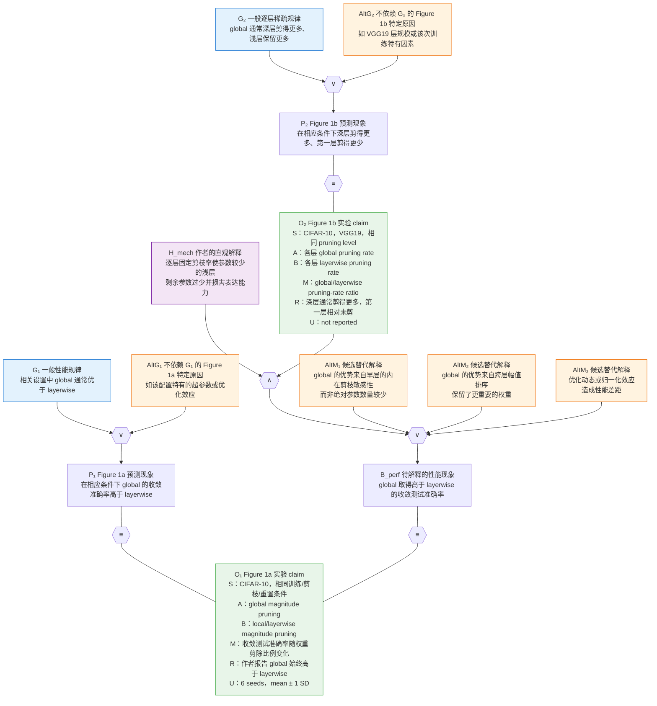

# Figure 1 实验 claim 候选草稿（修订版）

状态：**等待人工审阅，不进入正式 IR**。

本版保留 S/A/B/M/R/U 实验 claim 结构，并将六个字段共同写进 self-contained observation 节点；实验协议作为 provenance/setting 保存；随机彩票不属于“全局 vs. 逐层”核心比较；作者的机制直觉作为一个候选因果解释，与替代解释共同进入独立的 abduction 子网络。

## S/A/B/M/R/U 的含义

| 字段 | 含义 | 在 Figure 1 中的内容 | 是否默认拆成独立图节点 |
|---|---|---|---|
| S | 实验条件/适用范围 | 数据集、架构、训练预算、剪枝和重置日程 | 默认否；保留在 O 中，需要独立支持或复用时可提升为 setting/premise 节点 |
| A | 被评估方法 | 全局量级剪枝 | 默认否；保留在 O 中，方法定义被多处复用时可另建定义节点 |
| B | 直接比较对象 | 局部/逐层量级剪枝 | 默认否；保留在 O 中；本 claim 的 B 不是随机彩票 |
| M | 测量指标/响应变量 | Figure 1a 为收敛测试准确率；1b 为逐层剪枝率比值 | 默认否；作为实验 claim 固定字段写进 O，只有测量有效性本身被论证时才拆出 |
| R | 实际观测结果 | 全局性能更高；产生非均匀逐层稀疏模式 | 默认否；它是 O 的核心语义，而不是另一个与 O 重复的节点 |
| U | 重复次数与不确定性报告 | 1a 为 6 seeds、mean ± 1 SD；1b 为 `not reported` | 默认否；作为实验 claim 固定字段写进 O，需要独立审计时可拆出来源节点 |

这里保留原定模板：**M = metric/measurement**，**U = 重复次数或误差**。它们是实验 claim 内部的字段；Analogy 模式里的 `M` 则是类比桥梁命题，需要根据所在结构区分。

因此，“不自动成为图节点”不等于“从台账或 claim 中删除”。它只表示默认把完整的 `S+A+B+M+R+U` 作为一个 self-contained observation 节点 O；只有字段本身成为独立的可判真假命题，而且需要自己的证据路径时，才把它拆成单独节点。

## 实验操作是否有明确根据

有，但不同内容的证据强度不同：

| 协议内容 | 根据 | 建模方式 |
|---|---|---|
| 训练至收敛 → 剪枝 → 把保留权重重置到训练早期值 → 稀疏模型重新训练至收敛 | §3.1，第 68、74 行 | 协议背景，不是推理边 |
| 使用量级剪枝，每轮剪除剩余参数的 20% | §3.1，第 71 行 | 协议元数据 |
| 局部剪枝在每层内独立剪除相同比例；全局剪枝先汇集所有层权重 | §3.1，第 77–80 行 | A/B 的直接定义 |
| 最多 30 次剪枝迭代；CIFAR-10 彩票延迟重置到第 1 个 epoch | Appendix A.1，第 240 行 | 协议元数据 |
| 收敛测试准确率；每条曲线 6 个随机种子、均值 ± 1 SD | Figure 1 图注第 61 行、Results 第 98 行 | M/U 元数据 |

仍不明确的是 Figure 1a 图注是否把 VGG19 明示为该 panel 的架构，以及该实验使用哪个优化器。确认前不应把这两项写成直接事实。

## 两个核心 observation claim

### `OTWTA-EXP-F1A-01`：全局剪枝与局部（逐层）剪枝的性能比较

- **S**：CIFAR-10 彩票发现实验及论文所述相同训练预算、迭代量级剪枝和延迟重置条件；VGG19 是待复核的共享架构。
- **A**：跨全部层汇总权重并全局剪除最小量级权重，各层剪枝率允许不同。
- **B**：在各层内部独立剪除相同比例的最小量级权重。
- **M**：收敛时 CIFAR-10 测试准确率，随剪除权重比例变化。
- **R**：作者报告在所测条件中始终观察到全局剪枝性能高于局部剪枝。
- **U**：6 个随机种子；均值 ± 1 个标准差。

候选 self-contained claim：

> 在 CIFAR-10 彩票发现实验及论文所述相同训练预算、迭代量级剪枝和延迟重置条件下，作者在所测剪枝比例上始终观察到全局量级剪枝所得中奖彩票的收敛测试准确率高于局部（逐层）量级剪枝所得中奖彩票；Figure 1a 的每条性能曲线基于 6 个随机种子并报告均值 ± 1 个标准差。

### `OTWTA-EXP-F1B-01`：全局剪枝产生的逐层稀疏模式

- **S**：CIFAR-10 上的 VGG19 迭代量级剪枝；在相同剪枝 level 下比较各卷积层。
- **A**：全局剪枝在每个卷积层产生的实际剪枝率。
- **B**：逐层固定比例剪枝在相同 level 下的层内剪枝率。
- **M**：`全局剪枝率 ÷ 局部（逐层）剪枝率`；大于 1 表示该层被全局方法剪得更多。
- **R**：较深层通常被优先剪除，第一卷积层被剪得更少并保持相对未剪。
- **U**：`not reported`；Figure 1b 未说明逐层比值的重复次数、聚合方式或误差。

候选 self-contained claim：

> 在 CIFAR-10 上的 VGG19 迭代量级剪枝实验中，与每层使用相同剪枝比例的局部（逐层）剪枝相比，作者观察到全局量级剪枝产生了非均匀的逐层稀疏模式：较深卷积层通常被优先剪除，而第一卷积层被剪得更少并保持相对未剪；Figure 1b 未报告该逐层比值的重复次数、聚合方式或误差。

`U=not reported` 被保留为实验 claim 的明确来源状态；它不意味着自动降低 claim 或推理边的概率。

## 随机彩票基线的意义与位置

随机彩票回答的是另一个问题：剪枝找到的稀疏初始化是否优于相同规模的随机稀疏初始化，从而是否具有“中奖彩票”应有的额外价值。

它是 Figure 1a 的第三个比较臂，但不是“全局剪枝 A 与逐层剪枝 B 哪个更好”这一核心 claim 的 B。因此本版把它移出核心图。若以后研究“全局/逐层方法是否都能找到中奖彩票”，再为“全局 vs. 随机”和“逐层 vs. 随机”建立两个独立 observation claim。

## 修订后的 weakpoint 细化方案

原粗结论把两个可独立判断的规律合在一起，先拆为：

- `G₁`：在相关 LTH 设置中，全局量级剪枝通常比逐层量级剪枝产生更高的中奖彩票性能。
- `G₂`：在相关 LTH 设置中，全局量级剪枝通常产生深层剪得更多、浅层保留更多的非均匀稀疏模式。

然后分别用 Gaia 的 induction 模式展开。由于目前每个规律只有 Figure 1 的一个实例，准确说它们只是两个**单实例的溯因支撑单元**；后续加入更多数据集、架构和重复配置，才形成更强的“重复 abduction = induction”。

这张图没有自然语言“解释”边，也没有 `O → weakpoint → G`。`G₁/G₂` 的归纳和 `H_mech` 的归因都由 `∧`、`∨`、entailment 和 `≡` 结构表达。

## 作者的“直观解释”怎么处理

作者所说的“逐层固定剪枝率会使参数较少的浅层只剩过少参数、从而损害表达能力”确实是归因链的一部分。正确处理不是删除它，也不是创建一条自然语言“解释”边，而是把它建成候选机制假说 `H_mech`：

- `H_mech` 与 O₂（global 确实少剪第一层）先通过 `∧` 组合，形成作者机制路径；
- 这条路径与多个替代解释共同进入 `∨`；
- 各条候选原因都可以导致待解释的性能现象 `B_perf`；
- `B_perf` 与 Figure 1a 的实际性能观测 O₁ 通过 `≡` 连接；
- 因此 O₁ 在已知 O₂ 的条件下会为 H_mech 提供溯因支持，但不会使 H_mech 自动成为唯一或已证实的原因。

图中的 `AltM₁–AltM₃` 是形式化时补入的候选替代解释，不是作者原文：global 的优势可能来自早层因结构位置而内在更敏感、跨层幅值排序保留了更重要的权重，或优化动态/归一化效应。它们后续都应依据论文或外部证据改写为更精确、可独立判真的 claim。

当前 Figure 1 只能说明 `H_mech` 与观测相容，区分能力仍弱。若要提高其 belief，需要主动控制第一层保留率、在相同逐层稀疏分布下比较性能，或交换层间剪枝配额等机制消融。

## 尚需人工确认

1. Figure 1a 是否与 Figure 1b 共用 VGG19 架构。
2. 是否接受正式 claim 只保留方向性趋势，不录入从图片人工估读的数值。

优化器、随机彩票掩码方式和 Figure 1b 的 U 不再是核心 claim 入账的阻塞项：优化器和随机掩码方式不写入核心命题；Figure 1b 则按固定模板明确写 `U=not reported`。

## 来源位置

- 图注：`paper_text_ocr_cleaned.md` 第 58–61 行。
- 彩票训练流程、全局/逐层剪枝定义、直接观察和作者解释：第 68–83 行。
- 指标、重复次数和误差：第 94–98 行。
- VGG19、训练日程及剪枝/重置参数：第 231–240 行。
- 原图：`images/867771291879342656_1.jpg`。
