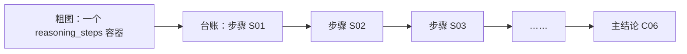

粗粒度视图展示 LKM 原始分析结构；证据台账把这个结构拆成可以逐条审计、定位原文和继续形式化的命题记录。

|方面|粗粒度视图|证据台账|
|---|---|---|
|数据来源|原始 `lkm_coarse_reasoning_graph.json`|原始 graph＋clean claims＋论文原文锚点|
|基本单位|结论、推理因子、highlight、weakpoint、研究问题|self-contained 命题|
|推理表示|一个 `reasoning_steps` 节点容纳多步推理|每一步拆成独立节点，可依次连接|
|可追溯信息|主要显示结构和摘要|稳定 ID、章节、图号、OCR 行号、原文、支持/限制对象、JSON Path|
|用途|快速理解论文论证框架|审核证据、发现缺口、准备进入 Gaia IR|

## 1. 粗粒度视图里是什么

它直接读取 [lkm_coarse_reasoning_graph.json](/Users/catherinewu/Documents/gaia-ir/01_paper_sample_one_ticket/lkm_coarse_reasoning_graph.json) 中的原始图，包含：

- 7 个主结论；
- 7 个 `reasoning_steps` 推理因子；
- 8 个 highlight，即证据摘要；
- 5 个 weakpoint/限制命题；
- 7 个研究问题；
- 共 34 个节点、27 条边。

这里的推理因子是“容器节点”。例如一个推理因子内部可能保存了五步或九步推理，但粗粒度视图只把整个容器画成一个节点。

因此，粗粒度图回答的是：

> 这篇论文大致有哪些结论？每个结论周围有哪些证据、限制和推理块？

它并不能充分回答：

> 某一步具体说了什么？来自哪一段？这一步是观察、前提还是解释？能否单独质疑？

## 2. 证据台账里增加了什么

证据台账共有 89 条记录，构成为：

- 23 条 clean claims；
- 7 个主结论；
- 8 个 highlight；
- 5 个 weakpoint；
- 7 个研究问题；
- 39 个从推理因子内部拆出来的推理步骤。

其中，主结论、highlight、weakpoint 和研究问题共 27 个，基本对应粗粒度图中的原节点。

真正增加或展开的是两部分。

### 第一类：23 个 clean-claim 节点

它们来自 [clean_claims_and_relations.json](/Users/catherinewu/Documents/gaia-ir/01_paper_sample_one_ticket/clean_claims_and_relations.json)，原始 ID 为 `A001`—`A025`，实际共有23条。

例如：

- `A001`：大型自然图像数据集上发现的彩票能够迁移到其他自然图像数据集；
- `A008`：源数据集规模带来的效果不能只用训练集样本数量解释；
- `A018`：在相应实验条件下，全局剪枝优于逐层剪枝；
- `A023`：跨层保留的掩码统计包含有用信息。

可视化给它们分配了稳定 ID：

```
A001 → OTWTA-CLM-A001
A018 → OTWTA-CLM-A018
A023 → OTWTA-CLM-A023
```

这些节点不是 HTML 临时“想出来”的，而是已有 clean-claims JSON 中的命题。HTML只是把它们映射到 C01—C07，并画到对应主结论周围。

### 第二类：把7个推理因子展开为39个步骤

粗粒度文件中的每个 `reasoning_steps` 节点都有一个 `steps` 数组：

- C01 对应的推理因子有9步；
- 其余六个推理因子各有5步；
- 合计39步。

证据台账把每一步变成独立记录，例如：

```
OTWTA-ARG-C06-S01
OTWTA-ARG-C06-S02
OTWTA-ARG-C06-S03
……
```

因此发生的是：

````

````

这里也没有新编造推理内容；步骤文本来自原始 graph 节点内部的 `steps` 数组。可视化只是将隐藏在容器里的步骤显式化。

## 3. 为什么89条不是34＋23＋39

因为粗图中的7个推理因子容器，在台账里被39个推理步骤替代：

```
粗图：
27个普通节点＋7个推理容器＝34个节点

证据台账：
27个普通节点＋23个clean claims＋39个推理步骤＝89条记录
```

所以相对于34个粗图节点，台账净增加55条：

```
新增23条clean claims
＋推理容器展开带来的净增加32条（39－7）
＝55条
```

## 4. 节点与论文原文是怎么对齐的

台账构建时使用了以下来源：

- [clean_claims_and_relations.json](/Users/catherinewu/Documents/gaia-ir/01_paper_sample_one_ticket/clean_claims_and_relations.json)：23条细化命题及11条命题关系；
- [lkm_coarse_reasoning_graph.json](/Users/catherinewu/Documents/gaia-ir/01_paper_sample_one_ticket/lkm_coarse_reasoning_graph.json)：粗图节点、边和39个推理步骤；
- [lkm_coarse_reasoning_graph_zh.json](/Users/catherinewu/Documents/gaia-ir/01_paper_sample_one_ticket/lkm_coarse_reasoning_graph_zh.json)：粗图节点与步骤的中文工作文本；
- [paper_text_ocr_cleaned.md](/Users/catherinewu/Documents/gaia-ir/01_paper_sample_one_ticket/paper_text_ocr_cleaned.md)：论文正文、章节及OCR行号锚点。

每条台账记录还增加了：

- 稳定 ID；
- 对应规范结论 `OTWTA-C01`—`OTWTA-C07`；
- 来源章节和图表；
- OCR行号及论文原文；
- 支持或限制哪个结论；
- 原始 JSON Path；
- 是否进入正式 IR。

## 5. 需要特别注意的可信度区别

证据台账中的节点并不都具有同样的证据地位：

- `clean_claims`：来自已清理命题文件，但部分仍标记为“需核对图中读数”；
- `highlight`：LKM提取的实验观察摘要；
- `weakpoint`：分析性限制命题，不一定是论文作者的直接结论；
- `reasoning step`：来自LKM粗图内部的推理步骤，当前状态是“待逐步审计”；
- 所有节点当前都尚未进入正式 Gaia IR。

因此，证据台账增加的是“可审计的分析粒度”，不等于增加了已经验证的新论文事实。它把原来压缩在粗图和JSON内部的内容摊开，并明确标出了哪些是论文观察、哪些是LKM解释、哪些仍需人工复核。