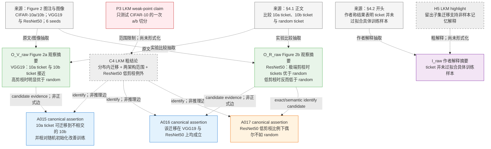
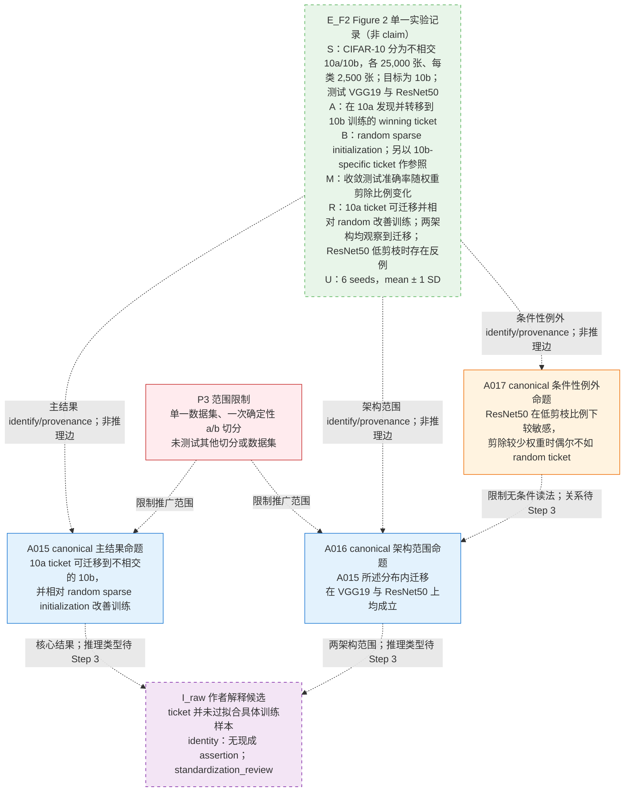
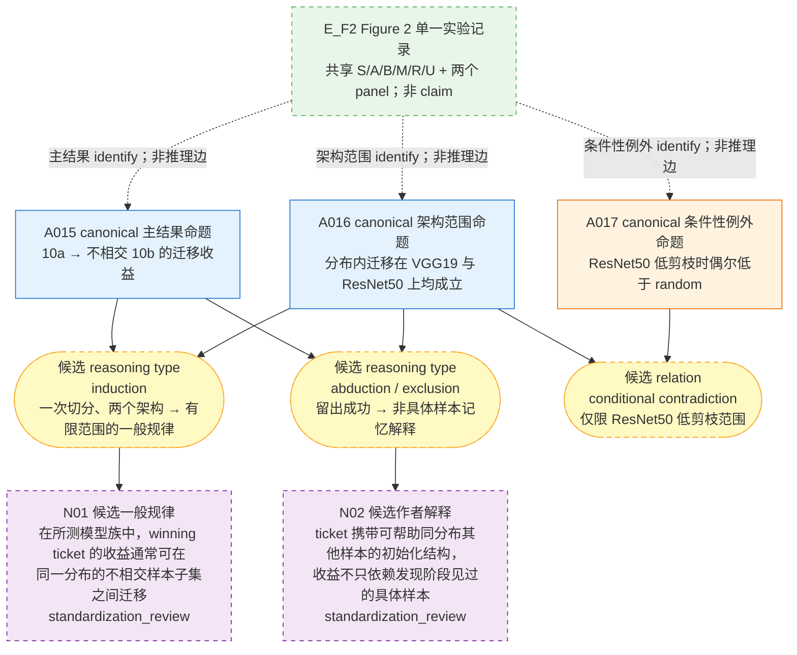
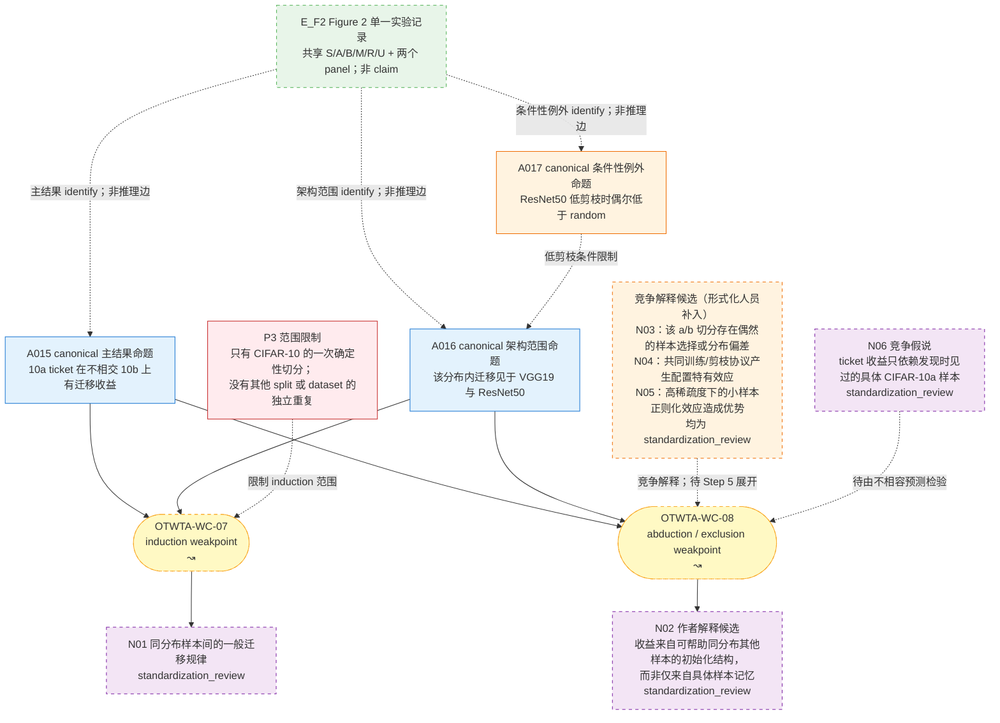
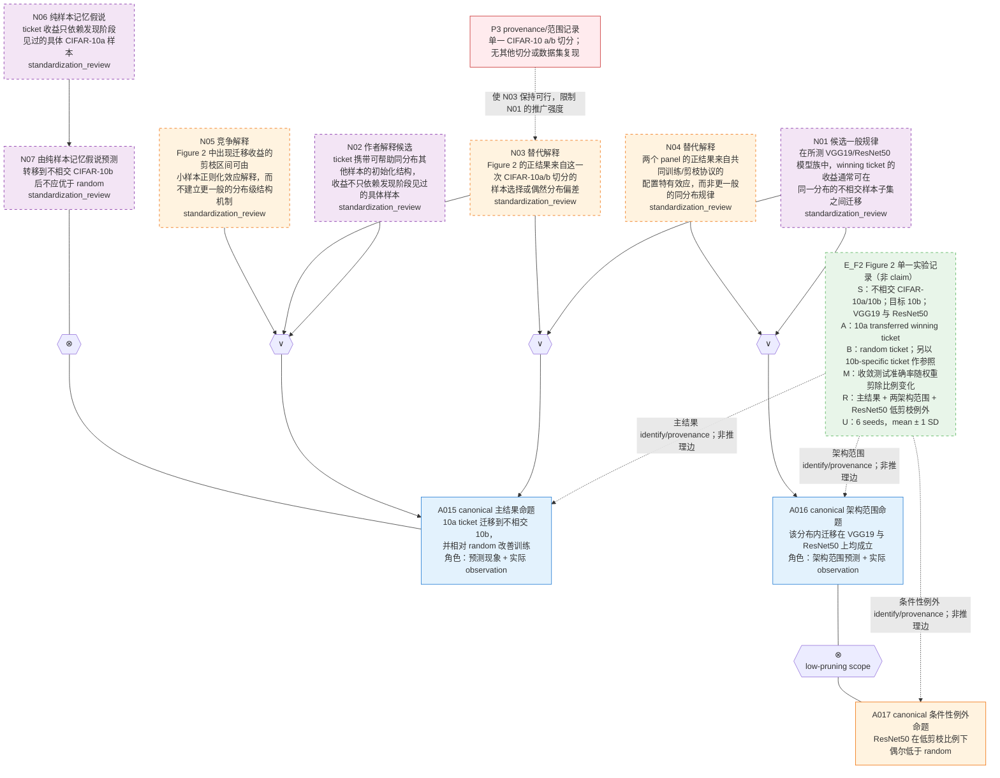

# Figure 2 节点细化：Step 1–5 本地测试

处理对象：*One Ticket to Win Them All* 的 Figure 2（CIFAR-10a → CIFAR-10b 分布内迁移）。本文件依照 `pipeline.md`，为每一步保留一张“截至该步”的累计 Mermaid 图。

证据锚点：

- `01_paper_sample_one_ticket/paper_text_ocr_cleaned.md:98`：统一指标、6 个随机种子与 `mean ± 1 SD`；
- `01_paper_sample_one_ticket/paper_text_ocr_cleaned.md:102-115`：Figure 2、实验设置、比较臂、结果与作者解释；
- `01_paper_sample_one_ticket/images/867771291879342656_2.jpg`：两个 panel 的曲线与图例；
- `01_paper_sample_one_ticket/clean_claims_and_relations.json`：canonical assertion registry；
- `01_paper_sample_one_ticket/lkm_coarse_reasoning_graph.json`：C4、H5、P3 与粗推理步骤；
- `01_paper_sample_one_ticket/lth_coarse_graph_weakpoints.json`：`OTWTA-WC-07/08`。

Canonical assertion 复用：

- `A015`：CIFAR-10a 彩票迁移到互不重叠的 CIFAR-10b，并相对随机稀疏初始化改善训练；
- `A016`：该分布内迁移在 VGG19 和 ResNet50 上均成立；
- `A017`：ResNet50 在低剪枝比例下敏感，偶尔不如随机彩票。

标准化状态说明：仓库中没有发现 `pipeline.md` 所约定的可调用黑盒原子化/标准化工具。因此本文件不伪造 `standardized_new` 状态；`N01–N07` 均明确标为 `standardization_review`。它们可用于 Step 4/5 的本地逻辑草图，但在黑盒标准化、identify 和去重完成前，不是正式 Gaia-IR claim，也不能作为 Step 6 的 frozen registry 输入。

## Step 1：建立证据台账

本步只导入 assertion registry、定位来源并完成粗节点 identity。来源箭头、identity 箭头和 LKM 粗脉络均不是正式推理边。

截至 Step 1：C4 已映射到 `A015/A016/A017`；H5 与 P3 保留为粗图来源。尚未补全实验字段，未确认推理类型。

## Step 2：补齐实验记录与结果 claim

Figure 2 只对应一个共享协议下的实验记录 `E_F2`。完整 S/A/B/M/R/U、两个 panel、曲线和 provenance 集中保存在 `E_F2` 中；`A015/A016/A017` 是从该记录 identify 出的三个已有原子结果命题，不是三个实验。

截至 Step 2：一个 `E_F2` 实验记录已经映射到三个已有原子结果命题；主结果、架构范围、条件性例外和作者解释相互分开。`E_F2` 不是 claim，实验操作与 identity/provenance 均不构成推理边；没有从图像人工估读精确数值或声称统计显著。

## Step 3：重新识别推理类型

- 从 CIFAR-10 的一次 a/b 切分及两个架构推广到“同分布不同样本通常可迁移”是 **induction**，不是 deduction；
- 从留出子集仍有收益推断“收益不依赖对具体源样本的记忆”是 **abduction / 排除性推理**；
- `A017` 对 `A015+A016` 的无条件读法构成低剪枝范围内的 **conditional contradiction/tension**；
- `E_F2` 只保存实验字段与 provenance，不参与这些推理。

截至 Step 3：推理类型已重判，`E_F2` 仍只承担 provenance；连接仍是宏观摘要，尚未显式加入替代解释，也未用逻辑算子展开。

## Step 4：显式化 weakpoint

`WC-07` 与 `WC-08` 分开处理：前者质疑从单次切分向一般规律的推广，后者质疑“非样本记忆/可迁移结构”是否为留出成功的唯一解释。

截至 Step 4：`E_F2` 仍只承担实验记录与 provenance；`WC-07/08` 已诚实保留为 `↝`，P3、条件范围和竞争解释已经显式呈现，但尚未主观填写概率。

## Step 5：展开为细命题网络

展开决策：

- Figure 2 只保留一个非 claim 的 `E_F2` 实验记录；`A015/A016/A017` 是从该记录 identify 出的三个已有原子结果命题；
- `E_F2` 集中保存 S/A/B/M/R/U、两个 panel 与 provenance，但不参与正式推理；
- `A015` 同时承担 “Figure 2 待预测现象” 与 “实际 observation” 两个角色，`A016` 同时承担架构范围预测与观察角色；因为 canonical 内容相同，直接复用节点，不再制造重复的 `P₁/P₂`，也不画虚假的自等价边；
- `WC-07` 被两个可复用的单实例 induction/abduction 单元替换；
- `WC-08` 使用作者解释、替代解释、纯样本记忆假说及其不相容预测展开；
- `A017` 通过 `⊗` 保留对无条件架构范围读法的低剪枝限制；它不否定高剪枝区间的正结果；
- `N01–N07` 在黑盒标准化完成前保持 `standardization_review`，因此下图是 Step 5 逻辑草图，不是可冻结的正式 IR。

截至 Step 5：`E_F2` 只承担实验记录与 provenance，A015/A016/A017 承担正式推理中的原子结果角色；`WC-07/08` 已被 `∨ / → / ⊗` 子网络替换。相同语义的 prediction/observation 已复用 A015/A016，没有为模板重复造 claim。A017 保留了 ResNet50 低剪枝区间的负结果，因此正结论只能作有条件解释。由于 `N01–N07` 仍处于 `standardization_review`，Step 5 结束冻结门禁尚未通过；下一步不是编码 Step 6，而是调用黑盒工具完成这些候选的原子化、identify、去重并按输出重画受影响的局部网络。
