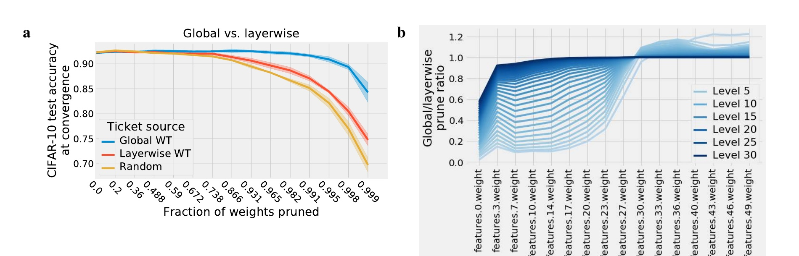
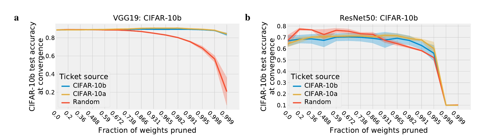
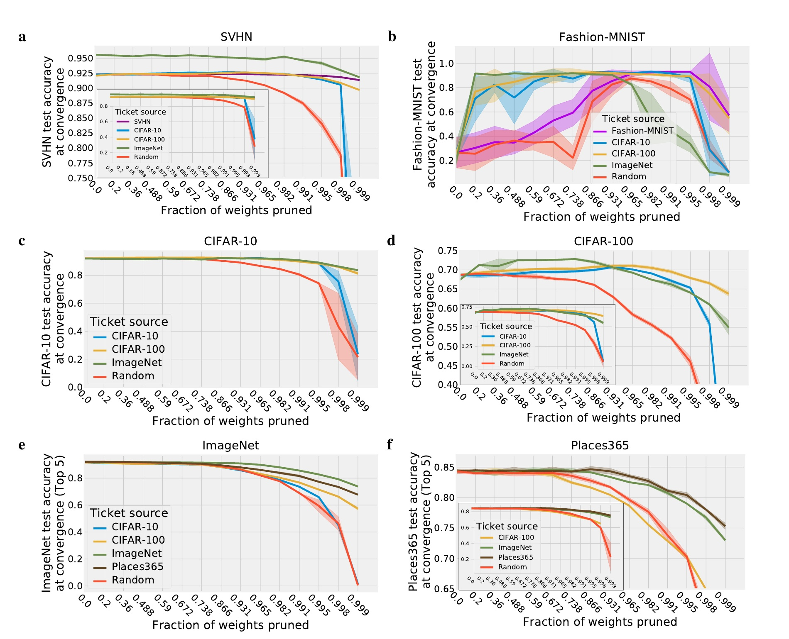
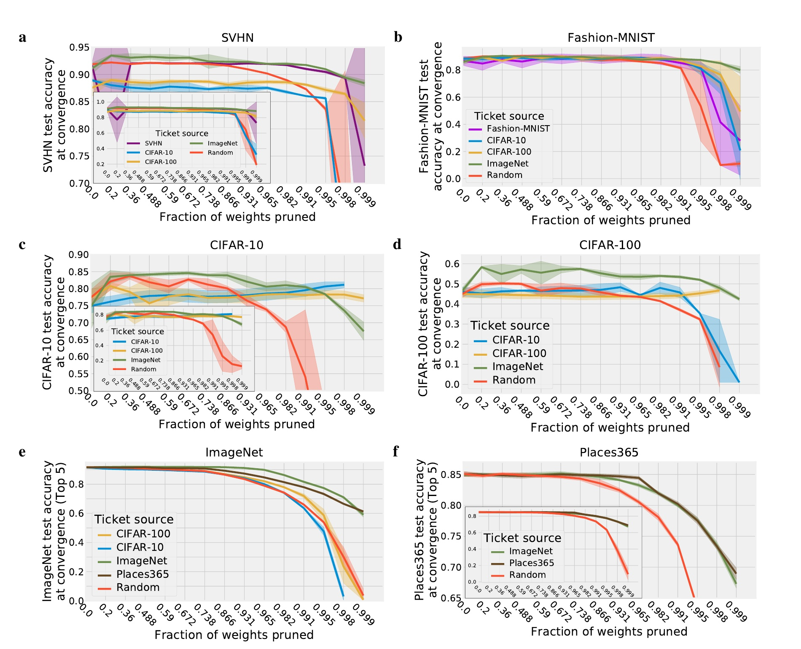
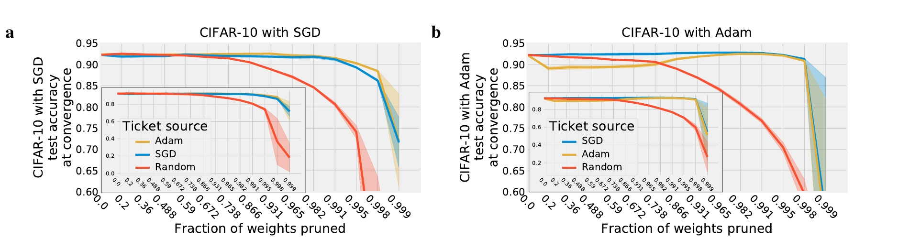
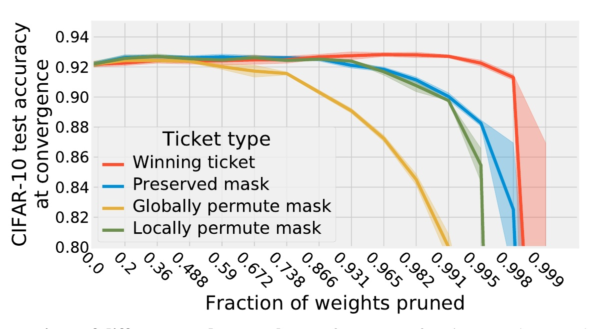

# 一张票赢得一切：彩票票据初始化在不同数据集和优化器之间的泛化

［#1］
Ari S. Morcos*
Facebook 人工智能研究院
arimorcos@fb.com

［#2］
Haonan Yu
Facebook 人工智能研究院
haonanu@gmail.com

［#3］
Michela Paganini
Facebook 人工智能研究院
michela@fb.com

［#4］
Yuandong Tian
Facebook 人工智能研究院
yuandong@fb.com

## 摘要

［#5］
彩票票据初始化的成功 [7] 表明，只要网络得到适当初始化，小型稀疏化网络就能够被训练。遗憾的是，寻找这些“中奖彩票”初始化的计算成本很高。一种可能的解决方案是在各种数据集和优化器之间复用相同的中奖彩票。然而，中奖彩票初始化的通用性仍不明确。本文试图回答这一问题：我们针对一种训练配置（优化器和数据集）生成中奖彩票，并在另一种配置上评估其性能。或许令人惊讶的是，我们发现，在自然图像领域内，中奖彩票初始化可以泛化到多种数据集，包括 Fashion-MNIST、SVHN、CIFAR-10/100、ImageNet 和 Places365，而且其性能往往接近在同一数据集上生成的中奖彩票。此外，使用较大数据集生成的中奖彩票，其迁移效果始终优于使用较小数据集生成的中奖彩票。我们还发现，中奖彩票初始化能够以较高性能跨优化器泛化。这些结果表明，由足够大的数据集生成的中奖彩票初始化包含更广泛地适用于神经网络的归纳偏置；这些偏置能够改善多种设置下的训练，并为开发更好的初始化方法带来希望。

## 1 引言

［#6］
最近提出的彩票票据假说 [7, 8] 认为，过参数化神经网络的初始化中包含小得多的子网络初始化；当这些子网络被单独训练时，它们能够达到与完整网络相近的性能。这些“幸运”子网络初始化的存在具有若干耐人寻味的含义。第一，它表明最常用的初始化方案主要是通过启发式方法发现的 [10, 14]，因而并非最优，仍有很大的改进空间。这与相关研究一致：具有理论依据的初始化方案能够支持对包含数百层的极深网络进行训练 [13, 27, 29, 33, 35]。第二，它表明，与先前的论点 [1, 2, 5, 6, 24, 25] 不同，训练过程中并不需要过参数化；过参数化可能只是在寻找参数规模适当的网络的“良好”初始化时才有必要。如果这一假说成立，那么我们通过训练并使用比实际所需规模大 1—2 个数量级的网络进行推理，正在浪费大量的计算资源。综合来看，这些结果暗示我们有可能开发出一种更好、更有原则依据的初始化方案。

［#10］
然而，寻找中奖彩票的过程需要反复交替执行若干轮操作：从头开始训练（可能很大的）模型直至收敛，然后进行剪枝。因此，寻找中奖彩票的计算成本很高。此外，目前尚不清楚，中奖彩票之所以能够产生高性能的那些性质，究竟是特定于架构、优化器和数据集的精确组合，还是包含能够更普遍地改善训练的归纳偏置。这一区分对于评估中奖彩票初始化未来的实用价值至关重要：如果中奖彩票过拟合于生成它们时所用的数据集和优化器，那么每遇到一个新数据集，就必须生成一张新的中奖彩票；这将要求训练完整模型并执行迭代剪枝，从而大幅削弱中奖彩票的影响。相反，如果中奖彩票具有更通用的归纳偏置，以至于同一张中奖彩票可以在不同训练条件和数据集之间泛化，那么就有可能只生成少量此类中奖彩票，并在不同数据集之间复用它们。此外，这还暗示我们可能对这类票据的分布进行参数化，从中采样通用且与数据集无关的中奖彩票。

［#11］
==本文通过提出如下问题来研究这一点：在一个数据集的情境中找到的中奖彩票，是否也能改善稀疏化模型在其他数据集上的训练？我们证明，能够找到单张可改善多个自然图像数据集训练的中奖彩票；并且对于许多数据集而言，这些迁移而来的中奖彩票几乎与数据集专用初始化表现相当，在某些情况下甚至表现得更好。我们还表明，由较大数据集（既包含更多训练样本，也包含更多类别）生成的中奖彩票，其跨数据集泛化能力显著优于由小数据集生成的中奖彩票。最后，我们发现中奖彩票也能跨优化器泛化，从而确认可以生成与数据集和优化器无关的中奖彩票初始化。==

## 2 相关工作

［#12］
我们的工作最直接地受到彩票票据假说的启发。该假说认为，由于可用子网络初始化的组合数量会爆炸式增长，因此采样到幸运且可训练的子网络初始化的概率会随网络规模增大而提高。彩票票据假说最初在 [7] 中针对较小模型和数据集提出并得到检验，随后在 [8] 中针对大型模型和数据集进行分析，并由此发展出后期重置方法。最近，[20] 对彩票票据假说提出了挑战，认为如果采用结构化剪枝的随机初始化子网络得到适当缩放并接受足够长时间的训练，它们便可以达到中奖彩票的性能。[9] 也在大型模型的情境中评估了彩票票据假说，但未能找到成功的中奖彩票；然而，关键在于他们没有采用迭代剪枝和后期重置，而这两者均已被证明是在大型模型中产生中奖彩票所必需的。不过，所有这些研究都只考察了中奖彩票在与生成它时完全相同的设置中接受评估的情形，因此并未衡量中奖彩票的通用性。

［#13］
本研究也深受模型剪枝文献的启发，因为剪枝方法的选择可能对最终中奖彩票的结构产生很大影响。具体而言，我们采用幅值剪枝，即优先剪除幅值最小的权重；这一方法最早由 [12] 提出。研究者还提出了许多变体，包括结构化变体 [19]，以及允许已剪除权重在训练过程中恢复的变体 [11, 37]。此外，还有许多其他剪枝方法，包括贪心方法 [22]、基于变分 dropout 的方法 [21]，以及基于特征图激活相似度的方法 [3, 28]。

［#14］
迁移学习已得到广泛研究，许多研究旨在将学习到的表征从一个数据集迁移到另一个数据集 [17, 31, 34, 38]。剪枝也在迁移学习情境中得到分析，主要做法是在新数据集和任务上微调剪枝后的网络 [22, 37]。这些结果表明，在一个数据集上训练模型并进行剪枝，随后在另一个数据集上微调，往往可以在迁移数据集上获得较高性能。然而，与本研究不同，这些研究考察的是*已学习表征的迁移*，而我们分析的是*初始化在数据集之间的迁移*。

［#15］

［#16］
图 1：全局剪枝与逐层剪枝。（a）CIFAR-10 上全局剪枝（蓝色）与逐层剪枝（红色）的彩票票据性能，以及一张随机票据（红色）的性能。误差条表示六个随机种子结果的均值 ± 标准差。（b）VGG19 各卷积层中全局剪枝率与逐层剪枝率之比。Level 表示剪枝迭代轮次，因此较浅的蓝色表示较低的总体剪枝率，而最深的蓝色表示总体剪枝率为 0.999。

## 3 方法

### 3.1 彩票票据假说

［#17］
彩票票据假说提出，过参数化网络的初始化中存在“幸运”的子网络初始化；当它们被单独训练时，即便超过 99% 的参数已被移除，它们仍能达到与完整模型相同、甚至在某些情况下更高的测试准确率 [7]。这一效应也存在于使用 ImageNet 训练的大型模型中，说明该现象并非小型模型所特有 [7]。寻找和评估中奖彩票的最简单方法是：将模型训练至收敛，进行剪枝，然后把剩余权重重置为训练开始时的值。接着再次将这个较小模型训练至收敛（“中奖彩票”），并与参数数量相同、但初始参数值随机抽取的模型（“随机票据”）比较。一张好的中奖彩票应显著优于随机票据。然而，尽管这种直接方法能为简单模型和数据集找到良好的中奖彩票（例如在 MNIST 上训练的多层感知机），它却无法处理更复杂的架构和数据集；为了生成良好的中奖彩票，需要采用若干“技巧”：

［#18］
**迭代剪枝** 当模型被剪枝时，通常会根据某种准则执行剪枝（更多细节参见相关工作）。这些剪枝准则虽然往往有效，但只是对权重重要性的粗略估计，而且常常带有噪声。因此，一次性剪除很大比例的权重（“一次性剪枝”）经常会把实际上很重要的权重剪掉。应对这一问题的一种策略，是多次迭代地交替执行训练和剪枝，每次迭代只剪除一小部分权重 [12]。由于每次迭代只剪除一小部分权重，迭代剪枝有助于为剪枝过程去噪，并能产生明显更好的剪枝模型和中奖彩票 [7, 8]。在本研究中，我们采用幅值剪枝，每次迭代剪除剩余参数的 20%。

［#19］
**后期重置** 在最初的彩票票据研究中，中奖彩票权重被重置为训练开始时（第 0 次训练迭代）的值；研究发现，对于大型模型中的中奖彩票，必须进行学习率预热 [7]。然而，在后续研究中，Frankle 等人 [8] 发现，只需把中奖彩票的权重重置为第 $k$ 次训练迭代时的值，其中 $k$ 远小于训练迭代总数，就能持续产生更好的中奖彩票，并消除学习率预热的必要性。这种方法被称为“后期重置”。在本研究中，我们独立确认了后期重置的重要性，并在所有实验中采用了后期重置（各实验所用的具体后期重置值见附录 A.1）。

［#20］
**全局剪枝** 剪枝可以采用两种不同方式：局部剪枝和全局剪枝。在局部剪枝中，各层的权重分别独立剪除，因此每一层被剪除的参数比例都相同。在全局剪枝中，剪枝前会把所有层汇集在一起，

［#20］
从而允许不同层具有不同的剪枝比例。==我们始终观察到，全局剪枝的性能高于局部剪枝（图 1a）==。因此，本研究始终采用全局剪枝。有趣的是，我们观察到，全局幅值剪枝会优先剪除较深层中的权重，尤其使第一层相对较少被剪枝（图 1b；浅蓝色表示总体剪枝比例较低的早期剪枝迭代，而深蓝色表示总体剪枝比例较高的后期剪枝迭代）。对这一结果的一种直观解释是：较深层的参数数量远多于较浅层，因此按恒定比例剪枝会对较浅层造成更大伤害，因为剪枝后它们剩余的绝对参数数量更少。例如，VGG19 的第一层只有 1792 个参数；如果以 99% 的比例剪枝，该层将只剩 18 个参数，从而严重损害网络的表达能力。

［#21］
**随机掩码** 在稀疏剪枝设置中，中奖彩票初始化包含两个信息来源：剩余权重的值，以及剪枝掩码的结构。在先前研究 [7–9] 中，随机票据初始化保留了剪枝掩码的结构，只对权重值本身进行随机化。然而，该掩码的结构包含大量信息，并且需要预先知道中奖彩票初始化（不同随机掩码的详细比较见图 A1）。因此，在本研究中，我们认为随机票据应同时具有随机抽取的权重值（从初始化分布中抽取）和随机置换的掩码。关于不同掩码结构所产生影响的更详细讨论，见附录 A.2。

### 3.2 模型

［#22］
实验使用两个模型进行：VGG19 [30] 的修改版本和 ResNet50 [15]。VGG19 的结构与 [30] 相同，但移除了所有全连接层，因此最后一层只是一个线性层，它把最后一个卷积层的全局平均池化输出映射到输出类别数（与 [7, 8] 相同）。模型架构及训练所用超参数的详细信息见附录 A.1。

### 3.3 跨数据集和优化器迁移中奖彩票

［#23］
为了评估中奖彩票的通用性，我们在一种训练配置（“源”）中生成中奖彩票，并在另一种配置（“目标”）中评估其性能。对于许多迁移，由于不同数据集具有不同数量的输出类别，因此需要改变输出层的大小。中奖彩票初始化只针对源架构定义，因而无法迁移到不同的拓扑结构；所以我们只需从中奖彩票中排除这一层，并对其重新随机初始化。由于模型的最后一个卷积层在最终线性层之前经过全局平均池化，因此输入维度的变化不要求修改模型。

［#24］
在源数据集和目标数据集相同的标准彩票票据实验中，每一轮训练都代表模型在当前剪枝比例下的中奖彩票性能。然而，在我们的实验中，源数据集/优化器与目标数据集/优化器不同；而且本研究主要关心目标数据集上的性能，因此必须在目标数据集上重新评估每张中奖彩票的性能，这会为每轮剪枝迭代增加一次额外训练。由此，我们在每轮剪枝迭代中额外运行两次训练：一次是在目标配置上训练中奖彩票，另一次是在目标配置上训练随机票据。

## 4 结果

［#25］
对于所有实验，我们都绘制收敛时的测试准确率，并以被剪除权重的比例为横轴。每条曲线均使用不同随机种子运行 6 次重复实验，阴影误差区域表示 $\pm$ 1 个标准差。对于给定目标数据集或优化器上的比较，模型接受相同轮数的训练（详见附录 A.1）。

### 4.1 同一数据分布内的迁移

［#26］
作为对中奖彩票能否泛化的首次检验，我们研究最简单的迁移形式：在从同一数据分布中抽取的样本之间进行泛化。为衡量这一点，我们把

［#27］

［#28］
**图 2：** 在同一数据分布内迁移中奖彩票。CIFAR-10 被分为两半（“10a”和“10b”），每一半均包含 25,000 个样本，每个类别包含 2,500 张图像。对于 VGG19（a）和 ResNet50（b），使用 CIFAR-10a 生成的中奖彩票都能很好地泛化到 CIFAR-10b。误差条表示六个随机种子结果的均值 ± 标准差。

［#29］
CIFAR-10 数据集分为两半：CIFAR-10a 和 CIFAR-10b。每一半均包含 25,000 张训练图像，每个类别包含 2,500 张图像。接着，我们考察使用 CIFAR-10a 生成的中奖彩票能否提高 CIFAR-10b 上的性能。为了评估迁移中奖彩票的影响，我们==将 CIFAR-10a 票据同时与随机票据和在 CIFAR-10b 本身生成的中奖彩票进行比较==（图 2）。有趣的是，对于 ResNet50 模型，虽然 CIFAR-10a 和 CIFAR-10b 的中奖彩票在极高剪枝比例下均优于随机票据，但在较低剪枝比例下，两者的表现都不及随机票据；这表明在较低剪枝比例下，ResNet 的中奖彩票可能对较小数据集格外敏感。

### 4.2 跨数据集迁移

［#30］
我们在从同一分布抽取的训练数据之间迁移中奖彩票的实验表明，中奖彩票并未过拟合于训练过程中呈现的特定数据样本，但中奖彩票仍有可能过拟合于数据分布本身。为回答这一问题，我们开展了大量实验，以评估在一个数据集上生成的中奖彩票能否泛化到同一领域（自然图像）内的不同数据集。

［#31］
我们使用六个复杂程度各异的自然图像数据集进行检验：Fashion-MNIST [32]、SVHN [23]、CIFAR-10 [18]、CIFAR-100 [18]、ImageNet [4] 和 Places365 [36]。这些数据集在多个维度上存在差异，包括灰度与彩色、输入大小、输出类别数和训练集大小。由于每条剪枝曲线都包含在每个剪枝比例下从头训练六个模型的结果（用以捕捉随机种子造成的变异），这些实验需要大量计算，尤其是使用 ImageNet 和 Places365 等大型数据集训练模型时。因此，为了最有效地分配计算资源，我们只在这些数据集上评估来自较大数据集的票据。对于所有比较，我们都在 VGG19（图 3）和 ResNet50（图 4）上进行了实验。

［#32］
在所有比较中，出现了若干关键趋势。首先，也是最重要的一点，*确实能够找到*可在所有数据集之间泛化、且性能接近在目标数据集上生成的中奖彩票的单张中奖彩票（例如，来自 ImageNet 和 Places365 数据集的中奖彩票）。这一结果表明，中奖彩票提供的归纳偏置中有很大一部分*与数据集无关*（至少在同一领域内且源数据集较大时如此），并让我们有理由期待：可以只生成一次单张票据或此类中奖彩票的分布，随后将其用于不同任务和环境。

［#33］
第二，我们始终观察到，在更大、更复杂的数据集上生成的中奖彩票，其泛化能力*显著优于*在小数据集上生成的中奖彩票。这一点在来自 ImageNet 和 Places365 源数据集的中奖彩票上尤其明显，它们在所有数据集上都展现出具有竞争力的性能。有趣的是，这一效应并非仅仅是训练集大小造成的，类别数量似乎也会影响它。最清楚的例子是使用 CIFAR-10 和 CIFAR-100 生成的中奖彩票表现不同：两者都包含总计 50,000 个训练样本，但类别数量不同。CIFAR-100 票据的泛化表现始终优于 CIFAR-10 票据，即便迁移到 Fashion-MNIST 和 SVHN 等简单数据集时也是如此。这表明，只增加类别数量而保持数据集

［#34］

［#35］
图 3：VGG19 的中奖彩票在不同数据集之间的迁移。中奖彩票在以下目标数据集上的性能：SVHN（a）、Fashion-MNIST（b）、CIFAR-10（c）、CIFAR-100（d）、ImageNet（e）和 Places365（f）。在每张图中，每条线表示中奖彩票的一个不同源数据集。在为了显示微小差异而缩窄 y 轴范围的情况下，插图中给出了完整 y 轴。误差条表示六个随机种子结果的均值 ± 标准差。

［#36］
大小不变，便可能显著提高中奖彩票的泛化能力（例如，比较图 3e 中 CIFAR-10 和 CIFAR-100 票据的性能）。

［#37］
有趣的是，我们还观察到，当网络相对于任务复杂度而言极度过参数化时，例如将 VGG19 应用于 Fashion-MNIST，迁移而来的中奖彩票在低剪枝率下大幅优于在 Fashion-MNIST 本身生成的中奖彩票（图 3b）。在这种设置中，使用 Fashion-MNIST 训练的大型网络发生严重过拟合，导致低剪枝率下的测试准确率很低；随着更多权重被剪除，准确率才逐渐提高。然而，在其他数据集上生成的中奖彩票避开了这一问题：在相同剪枝率下，即使 Fashion-MNIST 的中奖彩票也无法得到训练，这些迁移票据却能达到较高准确率（图 3b）。这再次表明，迁移票据提供了额外的正则化作用，能够抵御过拟合。

［#38］
最后，我们观察到，中奖彩票在 VGG19 和 ResNet50 模型上的迁移成功程度大致相似，但仍存在若干差异。与先前结果 [8] 一致，当大约仅剩 5%—10% 的权重时，ResNet50 模型在大型数据集上的性能开始迅速下降；相比之下，即使剪除了 99.9% 的权重，VGG19 模型的准确率也只出现小幅下降。另一方面，在小数据集上的极高剪枝比例下，与过参数化模型相比，ResNet50 模型始终能够达到相近或仅略有下降的性能（例如图 4c 和图 4d）。这些结果表明，ResNet50 模型可能具有比 VGG19 模型更陡峭的“剪枝悬崖”。

［#39］

［#40］
图 4：ResNet50 的中奖彩票在不同数据集之间的迁移。中奖彩票在以下目标数据集上的性能：SVHN（a）、Fashion-MNIST（b）、CIFAR-10（c）、CIFAR-100（d）、ImageNet（e）和 Places365（f）。在每张图中，每条线表示中奖彩票的一个不同源数据集。在为了显示微小差异而缩窄 y 轴范围的情况下，插图中给出了完整 y 轴。误差条表示六个随机种子结果的均值 ± 标准差。

### 4.3 跨优化器迁移

［#41］
在以上各节中，我们证明了中奖彩票可以在同一领域内跨数据集迁移，这表明中奖彩票学习到了能够改善训练的通用归纳偏置。然而，中奖彩票也有可能特定于所使用的某个优化器。中奖彩票提供的起点使某个特定最优点变得可达，但对标准随机梯度下降（SGD）的扩展可能会改变某些状态的可达性，以至于使用一个优化器生成的中奖彩票无法泛化到另一个优化器。

［#42］
为检验这一点，我们使用两个优化器生成中奖彩票（带动量的 SGD 和 Adam [16]），并评估使用一个优化器生成的中奖彩票能否在使用另一个优化器时提高性能。我们发现，与跨数据集迁移相同，VGG 模型的迁移中奖彩票达到了与使用源优化器生成的中奖彩票相近的性能（图 5）。有趣的是，我们发现，从 SGD 迁移到 Adam 的票据在低剪枝比例下表现不及随机票据，但在高剪枝比例下显著优于随机票据（图 5b）。总体而言，这一结果表明，VGG 的中奖彩票并未过拟合于生成它时使用的特定优化器，即 VGG 的中奖彩票与优化器无关。

［#43］

［#44］
图 5：VGG 的中奖彩票在不同优化器之间的迁移。使用带动量的 SGD（a）和 Adam（b）进行训练时的票据性能。在每张图中，每条线表示中奖彩票的一个不同源优化器。在为了显示微小差异而缩窄 y 轴范围的情况下，插图中给出了完整 y 轴。误差条表示六个随机种子结果的均值 ± 标准差。

## 5 讨论

［#45］
在本研究中，我们证明了中奖彩票能够在多种训练配置之间迁移。这表明，从足够大的数据集中获得的中奖彩票并未过拟合于某个特定优化器或数据集；相反，它们具有能够更普遍地改善稀疏化模型训练的归纳偏置（图 3 和图 4）。我们还发现，使用样本数和类别数更多的数据集生成的中奖彩票，其迁移效果始终更好；这说明更大的数据集会促进产生更通用的中奖彩票。综合来看，这些结果表明，中奖彩票初始化满足最终构建彩票票据初始化方案所必需的一个前提条件（通用性），并让我们更加深入地理解了使中奖彩票初始化独具特点的因素。

### 5.1 注意事项和后续工作

［#46］
彩票票据初始化的通用性令人鼓舞，但仍存在若干关键限制。第一，虽然我们的结果表明，只需生成少量中奖彩票，但通过迭代剪枝生成这些中奖彩票的速度很慢；在极高剪枝比例下（例如 0.999），可能需要串行地重新训练源模型多达 30 次。鉴于我们观察到较大数据集会产生更通用的中奖彩票，这一问题尤其突出，因为这些模型的每次训练都需要大量计算资源。

［#47］
第二，我们只评估了中奖彩票在同一领域（自然图像）和同一任务（物体分类）内跨数据集迁移的情况。中奖彩票初始化所赋予的归纳偏置可能只适用于某种给定的数据类型或任务结构，而这些初始化未必能够迁移到其他任务、领域或多模态设置。未来的工作需要评估中奖彩票跨领域和跨多种任务集合的泛化能力。

［#48］
第三，虽然我们发现迁移而来的中奖彩票往往能达到与在同一数据集上生成的中奖彩票大致相近的性能，但迁移票据与同数据集票据之间常常存在一个虽小却显而易见的差距。这表明，中奖彩票所赋予的归纳偏置中有一小部分*确实*依赖于数据集。对于在小数据集上生成的中奖彩票，这一效应尤其明显。然而，中奖彩票的哪些方面依赖于数据集、哪些方面与数据集无关，目前仍不清楚。理解这一差异并研究缩小该差距的方法，将是未来的重要工作，并且也可能有助于实现跨领域迁移。

［#49］
第四，我们只评估了源训练配置和目标训练配置中网络拓扑均固定的情况。这一点构成了限制，因为它意味着必须为每一种架构拓扑生成一张新的中奖彩票；不过，我们的实验表明，少量层可以重新初始化，而不会显著损害中奖彩票。因此，开发能够为新架构参数化中奖彩票的方法，将是未来研究的一个重要方向。

［#50］
最后，还有一个关键问题尚未得到回答：是什么让中奖彩票如此特殊？我们的结果只是模糊地揭示，令这些中奖彩票独具特点的因素具有

［#50］
某种程度的通用性，但究竟是什么让它们如此特殊，仍不清楚。理解这些性质，对于未来开发受彩票票据启发的更好初始化策略至关重要。

## A 附录

### A.1 模型细节和超参数

［#51］
**通用超参数** 所有模型均使用 PyTorch [26] 进行训练。对于 Fashion-MNIST、SVHN、CIFAR-10 和 CIFAR-100，使用在 2 块 GPU 上并行处理的 512 批大小。对于 ImageNet 和 Places365，使用在 16 块 GPU 上并行处理的 512 批大小，并采用同步分布式训练。对于使用 SGD 训练的模型，学习率为 0.1，动量为 0.9，权重衰减为 0.0001。对于使用 Adam 训练的模型，学习率为 0.0003，beta 值为 0.9 和 0.999，权重衰减为 0.0001。

［#52］
**VGG19** VGG19 按照 [30] 实现，但与 [7, 8] 相同，移除了所有全连接层，并用一个平均池化层取而代之。具体而言，滤波器大小如下：{64, 64, 最大池化, 128, 128, 最大池化, 256, 256, 256, 256, 最大池化, 512, 512, 512, 512, 最大池化, 512, 512, 512, 512, 全局平均池化}。全程应用 ReLU 非线性，并在每个卷积层之后应用批量归一化。所有卷积层均采用大小为 3、填充为 1 的卷积核；所有卷积层均使用 Xavier 正态初始化，偏置初始化为 0，而批量归一化的权重和偏置参数分别初始化为 1 和 0。所有 VGG19 模型均训练 160 个 epoch。学习率在第 80 和第 120 个 epoch 时衰减为原来的十分之一。

［#53］
**ResNet50** ResNet50 按照 [15] 实现。具体而言，各块的结构如下（步幅、滤波器大小、输出通道数）：(1×1, 64, 64, 256) × 3，(2×2, 128, 128, 512) × 4，(2×2, 256, 256, 1024) × 6，(2×2, 512, 512, 2048) × 3；随后是一个平均池化层和一个线性分类层。所有 ResNet50 模型均训练 90 个 epoch。学习率在第 50、65 和 80 个 epoch 时衰减为原来的十分之一。

［#54］
**剪枝参数** 对于所有模型，迭代剪枝率均设为 0.2，并执行 30 轮剪枝迭代。从第六轮剪枝迭代之后开始，每隔三轮剪枝迭代评估一次模型性能。剪枝采用幅值剪枝，与 [12, 19] 相同，优先移除幅值最小的权重。对于 Fashion-MNIST、SVHN、CIFAR-10 和 CIFAR-100 的中奖彩票，采用 1 个 epoch 的后期重置。对于 ImageNet 和 Places365 的中奖彩票，采用 3 个 epoch 的后期重置。

### A.2 随机化掩码

［#55］

［#56］
图 A1：不同随机掩码的比较。不同随机掩码在 CIFAR-10 上的性能。误差条表示六个随机种子结果的均值 ± 标准差。

［#57］
当模型以非结构化方式进行剪枝时，最终剪枝模型有两个可能携带信息的方面：权重本身的值，以及用于剪枝的掩码结构。在最初的彩票票据研究 [7] 中，坏票据使用随机抽取的值，但保留了中奖彩票的掩码。这会产生一个非预期后果：把信息从中奖彩票传递给坏票据，从而可能抬高坏票据的性能。鉴于我们观察到全局剪枝

［#57］
相较于逐层剪枝能产生显著更好的性能，并表现出明显不同的逐层剪枝比例（图 1），这一问题似乎格外相关；这说明掩码统计量很可能包含重要信息。

［#58］
为检验这一点，我们评估了三种掩码：保留掩码、全局置换掩码和局部置换掩码。在保留掩码的情形中，随机票据使用中奖彩票找到的同一个掩码。在局部置换的情形中，掩码在每一层内部进行置换，从而打破掩码的精确结构，但保持逐层统计量不变。最后，在全局置换的情形中，掩码跨所有层进行置换，因此中奖彩票与坏票据之间不应传递任何信息。

［#59］
与彩票票据假说一致，我们发现中奖彩票优于所有随机票据（图 A1）。有趣的是，虽然对掩码进行局部置换会在一定程度上损害性能（蓝色与绿色相比），但对掩码进行全局置换会导致性能大幅下降（蓝色/绿色与黄色相比）；这表明，通过训练过参数化模型得到的逐层统计量包含非常丰富的信息。如果不经历生成中奖彩票的过程，就无法获得这些信息。因此，我们认为，纯随机掩码是与从头训练一个具有同等参数规模的模型最为相关的比较对象。
