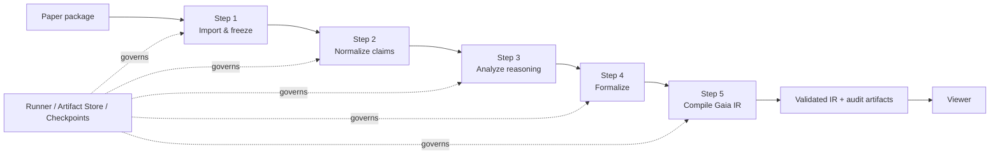

# Gaia IR

**An auditable pipeline for turning scientific papers into structured reasoning graphs and Gaia IR.**

Gaia IR separates scientific reasoning from execution state. A paper is imported, its evidence and claims are normalized, reasoning is formalized, and the result is compiled and checked with the official Gaia toolchain. Every successful stage leaves a reproducible trail of frozen inputs, content hashes, artifacts, checkpoints, and findings.

## Architecture



The runner owns execution, persistence, recovery, and audit state. Domain plugins own paper reasoning and formalization. The Viewer is a projection of stored artifacts; it is never a second authoring source of truth.

## What is in the repository

| Path | Purpose |
| --- | --- |
| [`agent/`](agent/) | Reusable Harness: runner, artifact store, checkpoints, validation, provenance, and Viewer projection. |
| [`pipelines/single_paper/`](pipelines/single_paper/) | Maintained Pipeline 7.0 single-paper flow, including Step 1–5 configuration and tests. |
| [`pipelines/merge/`](pipelines/merge/) | Pipeline 8.0 multi-paper integration flow and delta generation. |
| [`pipelines/clean_claims/`](pipelines/clean_claims/) | Compatibility entry points for the earlier claim-cleaning workflow. |
| [`docs/`](docs/) | Gaia IR contract, identity, hashing, canonicalization, lowering, and validation notes. |
| [`merge_domain_graph/`](merge_domain_graph/) | Published v1–v9 comparison pages and the verified v9 Viewer. |
| [`examples/`](examples/) | Small reviewable Harness examples. |
| [`bohr/`](bohr/) | External experiment and batch-job helpers; not the default local entry point. |
| [`archive/`](archive/) | Historical configurations and entry points retained for reference. |

`paper2ir` is a separate repository for the earlier standalone paper-to-claim-network workflow and is intentionally kept independent.

## Two maintained workflows

### Single paper

`single-v2` runs the current single-paper Harness pipeline:

```text
import → claim normalization → reasoning analysis → formalization → Gaia IR compilation
```

It maintains one revision chain for `formalization.json`, carries source anchors through each step, and accepts `gaia.ir` only after the official compiler and deterministic checks pass.

### Multi-paper merge

`merge` freezes several paper packages, retrieves cross-paper candidates, identifies shared structures, formalizes an integration delta, and compiles the result with the official Gaia compiler. The checked `pipeline_merge_v9` artifact is documented below.

## Quick start

The repository uses the bundled Gaia `0.5.0a7` environment. From the repository root:

```bash
./run_pipeline.sh list
./run_pipeline.sh single-v2 /absolute/path/to/manifest.json
./run_pipeline.sh merge /absolute/path/to/manifest.json
```

The launcher reports the selected pipeline, configuration hash, Git revision, worktree state, and imported module path before starting. Use the complete `pipeline.step1-5.json` or merge configuration for a new run. The step-specific JSON files are for isolated development and tests; they do not resume a historical run by themselves.

The compatibility entry point remains available when an older run must be reproduced:

```bash
./run_pipeline.sh legacy <paper_id>
```

## Reproducibility and artifacts

A run is organized around two linked state chains:

- **Execution state:** `run.json → checkpoint → events.ndjson`, which records attempts, status, and failures.
- **Domain state:** frozen inputs → `formalization.json` revisions → indexes → official `gaia.ir`, which records the accepted scientific structure.

Artifacts are content-addressed and passed between stages through explicit contracts. Generated runs, caches, virtual environments, local secrets, and large intermediate datasets stay local by default. The repository includes selected frozen presentation artifacts when they are needed to inspect a verified result.

## Verified `pipeline_merge_v9`

The five-paper merge run completed with status `succeeded`:

| Metric | Result |
| --- | ---: |
| Graph nodes | 318 |
| Graph edges | 257 |
| Integration-delta edges | 74 |
| Delta composition | 62 deduction · 10 abduction · 2 contradiction |
| Conclusion structure | 1 tree covering 8 L1 conclusions + 3 independent L1 conclusions |

The last line is intentional: v9 is a verified forest, not a single-root tree. The run retains a `GRAPH_DISCONNECTED` warning for the three independent conclusions.

- [Open the v9 Viewer](merge_domain_graph/viewer_final.html)
- [Browse the v1–v9 comparison](merge_domain_graph/index.html)
- [Read the v9 run notes](bohr/merge/RUNS.md)
- [Inspect the projected view model](outputs/bohr_runs/merge_test1-5_v9_final/view_model.json)
- [Inspect the generated domain graph](outputs/bohr_runs/merge_test1-5_v9_final/domain_graph.html)

The reusable Viewer template is [`agent/pipeline_harness/view/viewer.html`](agent/pipeline_harness/view/viewer.html). The v9 Viewer is a frozen, self-contained presentation of the verified run.

## Tests

Use the repository environment so the official Gaia package is available:

```bash
PYTHONPATH=agent .venv-gaia-a7/bin/python \\
  -m unittest discover -s agent/tests -p 'test_*.py'

PYTHONPATH=agent:pipelines/single_paper .venv-gaia-a7/bin/python \\
  -m unittest discover -s pipelines/single_paper/tests -p 'test_*.py'
```

The current verified baseline is **47 Harness tests + 89 single-paper tests passing**. Tests are offline by default; semantic tools and external model calls are only used when explicitly configured.

## Design commitments

- **Official Gaia alignment:** compile and validate against the pinned Gaia package rather than maintaining a parallel IR contract.
- **Mechanical checks first:** hashes, schema checks, provenance, reference closure, and compiler validation decide what can be published.
- **One source of truth:** views, indexes, summaries, and charts are derived from artifacts and never become authoring state.
- **Recoverable execution:** failed and waiting attempts remain auditable without silently becoming downstream inputs.
- **Conservative semantics:** unresolved reasoning stays visible as a finding or weakpoint instead of being promoted to an unsupported claim.

## Status

This is the active Gaia IR implementation. The latest uploaded commits contain the maintained single-paper pipeline, the verified `pipeline_merge_v9` artifacts, and the current general Viewer.
