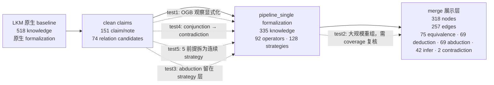

# LKM 基线、clean claims、formalization 与 merge 对比

## 读图方式

主图采用“处理链”而不是 Mini K/原生 K/新增/缺失/相同四个孤立数字：LKM 原生结果是基线，依次比较 clean claims、pipeline_single formalization 和最终 merge。节点代表当前阶段可展示的知识对象；边代表当前阶段显式保留的关系或推理连接。

## 五篇单篇结果统计

|阶段|test1|test2|test3|test4|test5|合计/说明|
|---|---:|---:|---:|---:|---:|---|
|LKM 原生 formalization knowledge|23|383|45|7|60|518；作为基线|
|clean claims（claim + note）|20|85|11|7|28|151；关系字段另计|
|pipeline_single formalization knowledge|32|216|26|12|49|335|
|pipeline_single graph 节点|29|211|25|11|48|324|
|pipeline_single operator|9|76|0|2|5|92|
|pipeline_single strategy|12|52|16|3|45|128|

clean claims 的 relation 数分别为 13、49、0、0、12。它们是“关系候选”，不直接等同于 formalization graph edge；formalization 会将其中一部分落为 operator 或 strategy。

## 应如何理解差异

“新增、缺失、相同”只适合做审计表，不适合做主图。按 canonical content 去重后，相对原生 formalization：test1 为新增 12、缺失 3、相同 20；test2 为新增 130、缺失 297、相同 85；test3 为新增 16、缺失 34、相同 10；test4 为新增 5、缺失 0、相同 7；test5 为新增 16、缺失 28、相同 32。test2 的集合漂移最大，应作为重点复核对象。

## 具体逻辑修改

1. test1：clean claims 新增 OGB 结果观察，formalization 进一步生成 `claim_E07`、`claim_O07` 以及等价关系 operator；同时删除原生重复参数复杂度 note。
2. test4：将“`claim_O03` 和 `claim_O04` 与 `claim_6` 不可同时成立”拆成 `conjunction(O03,O04)` 再连接 `contradiction(...,claim_6)`，把复合关系变成可编译的两步结构。
3. test5：将“五个前提推出 claim_19”的复合关系拆成多个 conjunction helper 和连续 strategy，降低单条关系的复杂度，但增加了路径数量。
4. test3：clean claims 只有 10 个 claim、没有 relation；formalization 仍生成 16 条 abduction strategy，说明逻辑主要落在 strategy 层，没有形成 operator。
5. test2：从 383 个原生 knowledge 收缩到 216 个 formalization knowledge，同时新增 130 个 canonical 内容，属于大规模重组，不能直接解释为“补全”。

## 展示建议

飞书展示时，主视觉使用三栏：LKM baseline、pipeline_single formalization、merge。clean claims 作为第二层小节点放在 baseline 与 formalization 之间。每栏显示“知识节点数 / 关系或推理边数 / 逻辑类型”，下方再放新增、缺失、相同审计表。这样领导先看到处理链和规模变化，再看到具体修复。

## 飞书画板：处理链与逻辑变化

图中实线表示处理阶段，虚线表示需要重点解释的逻辑变化。merge 是展示层汇总，不应被用来反推单篇 pipeline_single 的新增或缺失。

证据：`data/minibatch/test1` 至 `test5` 的 `claims_final.json`、`formalization.json`；原生 formalization 使用对应 `archive/runs/round1` 或 `round2` 目录；merge 使用 `outputs/bohr_runs/merge_test1-5_v9_final/view_model.json`。
