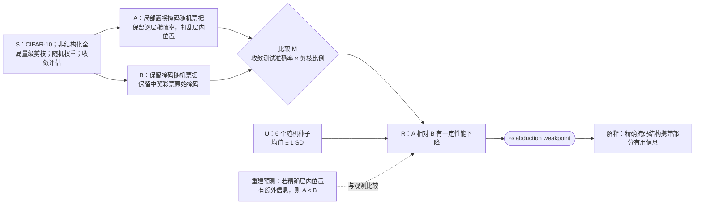

# OTWTA-EXP-A1-01 审阅稿

## 原子比较

Figure A1 实际包含四条曲线。本稿只处理第一条原子比较：

> **局部置换掩码的随机票据 vs 保留中奖彩票掩码的随机票据。**

## S/A/B/M/R/U 候选

| 字段 | 候选内容 |
|---|---|
| **S** | CIFAR-10；非结构化全局量级剪枝；随机票据权重从初始化分布抽取；迭代剪枝每轮删除剩余权重的 20%，最多 30 轮；CIFAR-10 延迟重置到第 1 个 epoch；训练收敛后评估。Figure A1 图注和 A.2 正文未明确模型与优化器，粗图 H7 标为 VGG19，暂待人工确认。 |
| **A** | 局部置换掩码随机票据：在每一层内部置换中奖彩票掩码，保留逐层稀疏率，打乱精确层内连接位置；权重值随机抽取。 |
| **B** | 保留掩码随机票据：使用中奖彩票的原始掩码，但权重值随机抽取。 |
| **M** | CIFAR-10 收敛测试准确率，作为被剪除权重比例的函数。 |
| **R** | 局部置换相较保留掩码造成一定程度的性能下降。不要写成“所有剪枝比例下均显著下降”；正文没有报告统一数值差或显著性检验。 |
| **U** | 每条曲线 6 个不同随机种子；均值 ±1 个标准差。 |

## self-contained 草稿

> 在 CIFAR-10 的非结构化全局量级剪枝实验中，研究者比较了两类使用随机抽取初始权重值的随机票据：一类保留中奖彩票的原始剪枝掩码，另一类在每一层内部置换该掩码、保留逐层稀疏统计但打乱精确的层内连接位置。以被剪除权重比例为横轴、以训练收敛时的测试准确率为指标，局部置换掩码条件相较于保留掩码条件表现出一定程度的性能下降。每条曲线基于 6 个不同随机种子的重复实验，报告均值 ±1 个标准差。

## 预测、观测与解释必须分开

- **预测**：作者未显式写出。可供 formalization 使用的重建版本是：“如果精确层内掩码位置含有额外信息，则局部置换应弱于保留掩码；如果只有逐层稀疏统计起作用，两者应接近。”
- **直接观测**：局部置换相较保留掩码造成一定性能下降。
- **作者解释**：精确的掩码结构携带部分有用信息；结合全局置换结果，逐层掩码统计也携带大量信息。
- **weakpoint**：从性能下降到“结构携带信息”是 abduction，不是 entailment。

## Mermaid

## 待审阅

1. 模型是否直接采用粗图的 `VGG19`，还是保持“Figure A1/A.2 未明确”？
2. 剪枝日程和重置点放在本 claim 内，还是提升为多个实验复用的 setting 节点？
3. 是否坚持使用论文的定性结果 `somewhat`，不从图中估读数值差？
