### 输入
- 已清洗的命题和部分关系：`conclusions_final.json`
- LKM 粗推理图：`graph.json`
- 论文正文：`ocr_converted.md` 和 `ocr.md`

### 做事
- 从论文正文、图表和实验结果中补齐缺失的“实验 claim”。
- 不相信粗图里的原始推理类型，依据内容重新识别演绎、归纳、溯因、类比等关系。
- 把粗粒度支撑关系进一步“底层化”：显式写出中间命题、实验条件、预测、观测、替代解释、等价与矛盾关系。
- 输出合法 Gaia-IR，并用已有的 compile/check、可视化或 validator 检查。

### 输出
- 一份该论文的 Gaia-IR 文件；
- 一份 `claim → OCR/图表证据位置` 的溯源表；
- 一份推理关系与细化决策记录；
- validator/compile 结果和可视化图。

## 流程
### 步骤一：建立证据台账

合并 `conclusions_final.json` 与 `graph.json`，为每个命题记录：

- 稳定 ID；
- self-contained 命题文本；
- 类型：结论、观察、假说、前提、背景或问题；
- 论文中的来源章节、图表或原文；
- 它支持或反驳哪个结论；
- 是否已经进入 IR。

不能只保留“论文表明 X”。必须能回到具体实验和原文。

### 步骤二：补齐实验 claim

一个实验至少拆成：

> 在条件 S 下，对象/方法 A 与基线 B 比较，在指标 M 上观察到结果 R，重复次数或误差为 U。

需要将以下内容分开：

- 实验设置；
- 实验操作；
- 预测；
- 实际观测；
- 作者据此作出的解释或一般化结论。

例如，“ImageNet ticket 可迁移”是解释层结论；“ImageNet ticket 在 CIFAR-10 的某一稀疏度上接近 target-specific ticket”才是实验观察。

### 步骤三：重新识别推理类型

不要沿用 LKM 的默认标签。逐条问：

- 前提为真时，结论是否逻辑必然成立？是则为演绎。
- 多组实例是否被推广为一般规律？是则为归纳。
- 是否从观测选择某个最佳解释？是则为溯因。
- 是否依赖跨领域或跨对象的桥梁主张？是则为类比。
- 是否由矛盾否定某个假说？可能是归谬或排除。

这篇论文主要是归纳/溯因：多组迁移实验共同支撑“winning ticket 包含通用 inductive bias”。归纳可以看作并行重复的溯因，因此首轮应优先保证底层结构正确，不必把精力浪费在边界模糊的标签争论上。

### 步骤四：显式化 weakpoint

对每个“实验结果 → 一般结论”的跳跃，列出：

- 隐含前提；
- 适用范围；
- 替代解释；
- 可能的混杂因素；
- 反例或限制。

例如，“大数据集产生更可迁移的 ticket”可能同时受到样本量、类别数、训练预算和数据复杂度影响。CIFAR-10 与 CIFAR-100 的对照削弱了“只有样本量”的解释，但并没有自动证明唯一因果机制。

证据不足时保留 weakpoint/soft implication，不要强行写成严格演绎。

### 步骤五：展开为细命题网络

对溯因/归纳，使用这一基本结构：

- `H`：假说或一般规律；
- `B`：H 所预测的实验现象；
- `AltExp`：不依赖 H 也能产生 B 的替代解释；
- `B'`：论文实际观察到的实验事实；
- `H ∨ AltExp → B`；
- `B ≡ B'`。

有多组实验时，为每组实验重复一套 `Bᵢ / AltExpᵢ / B'ᵢ`，共同支撑 H。

严格步骤则使用：

- 前提合取；
- implication；
- equivalence；
- contradiction。

关键点是：宏观上看起来是“观测支持假说”，但底层图的解释方向通常是“假说预测观测”，再由观测通过 Bayes 反向提升假说 belief。

```mermaid
flowchart TD
    G1["G₁ 一般性能规律<br/>相关设置中 global 通常优于 layerwise"]:::gen
    AltG1["AltG₁ Figure 1a 特定原因<br/>如配置特有的超参数或优化效应"]:::alt
    OR1{{"∨"}}
    P1["P₁ Figure 1a 预测现象<br/>global 的收敛准确率高于 layerwise"]
    O1["O₁ Figure 1a 实验 claim<br/>S：CIFAR-10，相同训练/剪枝/重置条件<br/>A：global magnitude pruning<br/>B：local/layerwise magnitude pruning<br/>M：收敛测试准确率随权重剪除比例变化<br/>R：作者报告 global 始终高于 layerwise<br/>U：6 seeds，mean ± 1 SD"]:::obs

    G1 --> OR1
    AltG1 --> OR1
    OR1 --> P1
    P1 --- EQ1{{"≡"}} --- O1

    G2["G₂ 一般逐层稀疏规律<br/>global 通常深层剪得更多、浅层保留更多"]:::gen
    AltG2["AltG₂ Figure 1b 特定原因<br/>如 VGG19 层规模或该次训练特有因素"]:::alt
    OR2{{"∨"}}
    P2["P₂ Figure 1b 预测现象<br/>深层剪得更多、第一层剪得更少"]
    O2["O₂ Figure 1b 实验 claim<br/>S：CIFAR-10，VGG19，相同 pruning level<br/>A：各层 global pruning rate<br/>B：各层 layerwise pruning rate<br/>M：global/layerwise pruning-rate ratio<br/>R：深层通常剪得更多，第一层相对未剪<br/>U：not reported"]:::obs

    G2 --> OR2
    AltG2 --> OR2
    OR2 --> P2
    P2 --- EQ2{{"≡"}} --- O2

    Hm["H_mech 作者的直观解释<br/>逐层固定剪枝率使参数较少的浅层<br/>剩余参数过少并损害表达能力"]:::hyp
    AltM1["AltM₁ 候选替代解释<br/>global 的优势来自早层的内在剪枝敏感性<br/>而非绝对参数数量较少"]:::alt
    AltM2["AltM₂ 候选替代解释<br/>global 的优势来自跨层幅值排序<br/>保留了更重要的权重"]:::alt
    AltM3["AltM₃ 候选替代解释<br/>优化动态或归一化效应造成性能差距"]:::alt
    ANDM{{"∧"}}
    ORM{{"∨"}}
    Bm["B_perf 待解释的性能现象<br/>global 取得更高的收敛测试准确率"]

    Hm --> ANDM
    O2 --> ANDM
    ANDM --> ORM
    AltM1 --> ORM
    AltM2 --> ORM
    AltM3 --> ORM
    ORM --> Bm
    Bm --- EQM{{"≡"}} --- O1

    classDef obs fill:#e8f5e9,stroke:#4caf50
    classDef gen fill:#e3f2fd,stroke:#1976d2
    classDef alt fill:#fff3e0,stroke:#ef6c00
    classDef hyp fill:#f3e5f5,stroke:#7b1fa2
```

### 步骤六：编码并校验 Gaia-IR

编码时重点遵守：

- 只有 `claim` 携带概率并参与推理；
- setting/note/question 不应冒充概率命题；
- helper claim 不能随意携带独立 prior；
- Knowledge、Operator、Strategy、Compose 的引用必须闭合；
- Strategy/Compose/FormalExpr 必须无环；
- 私有中间节点不能泄漏给外部 Strategy；
- 每个 conclusion 都应存在可追踪的支撑或反驳路径。

除了结构 validator，还应做语义验收：

- 每个关键 claim 能否回溯到论文证据；
- 是否把多个命题塞进一个节点；
- 是否混淆观察与解释；
- 是否越过了论文实际支持的适用范围；
- 是否遗漏负结果、限制和竞争解释。

