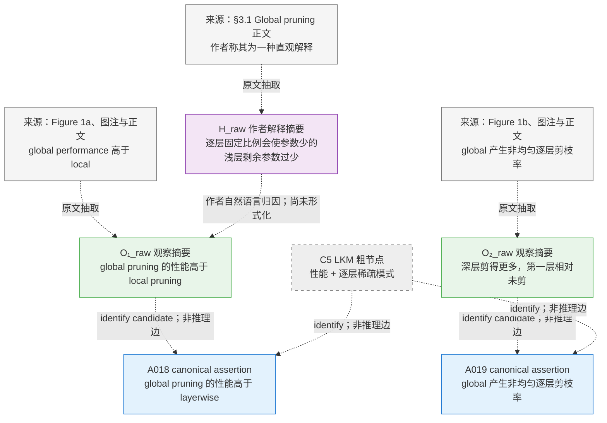
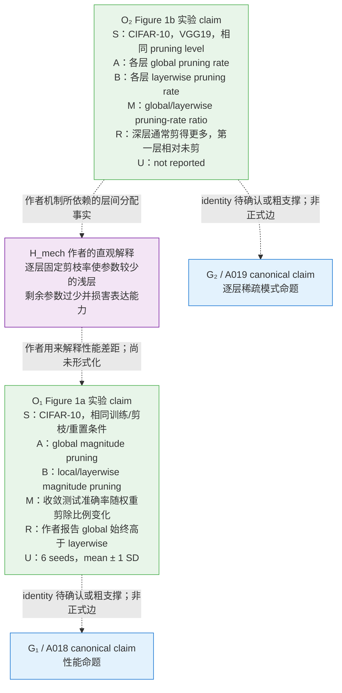
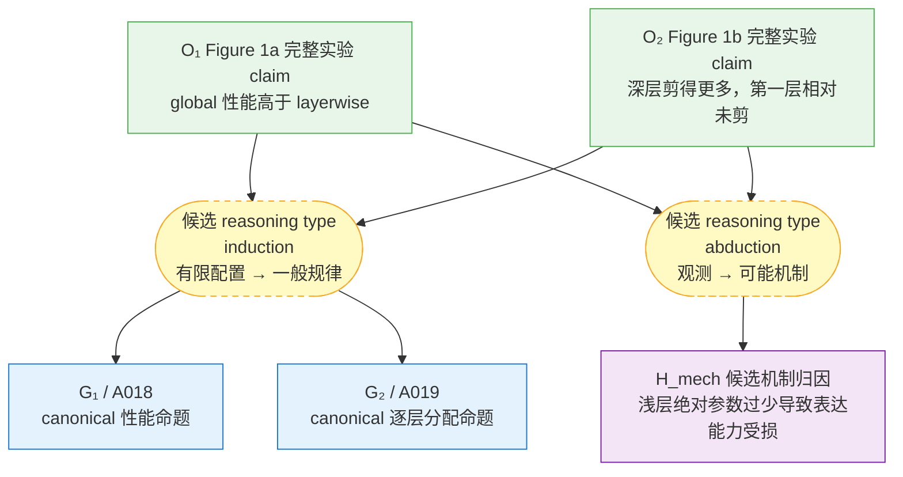
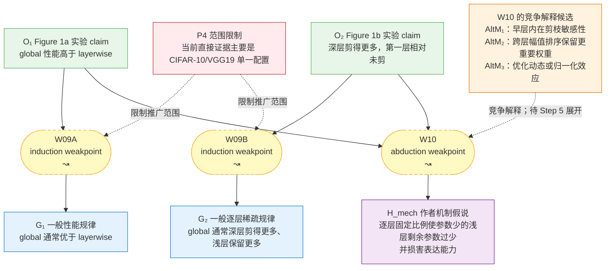
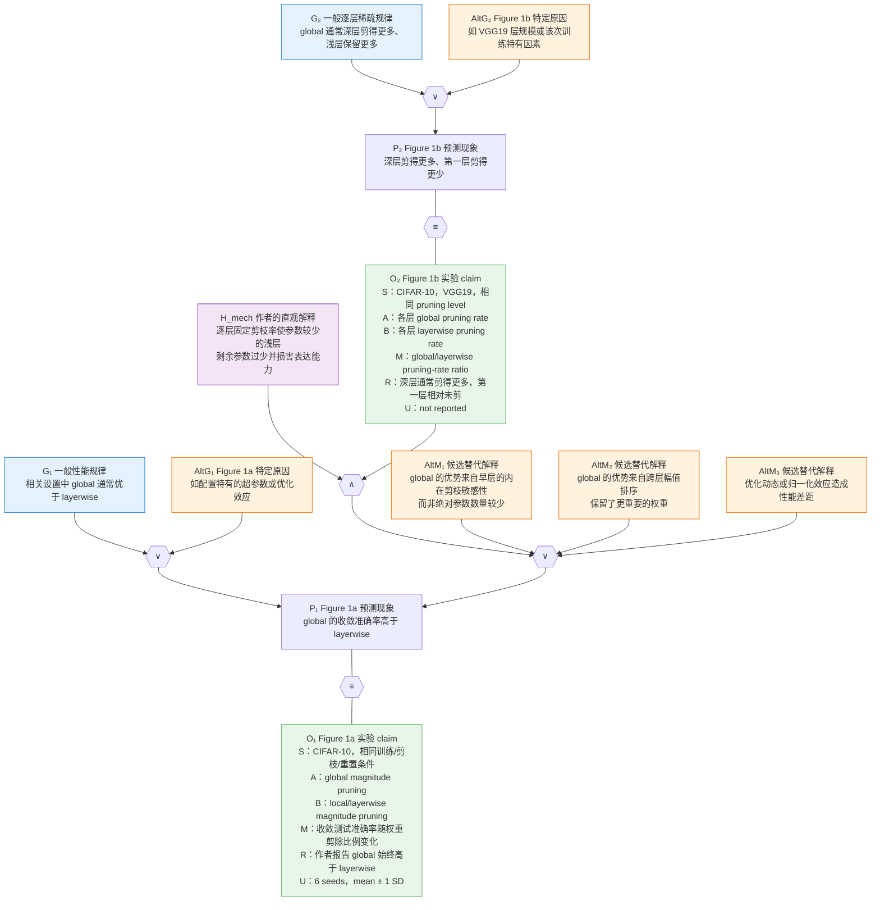

# Gaia 科学论证形式化 Pipeline

> 示例状态：LTH 论文 *One Ticket to Win Them All* 的 Figure 1 案例已完成到 **步骤五：细命题网络**。本文档在每一步都保留一张“截至该步”的累计图，作为后续处理论文其他结论和实验的模板。步骤六尚未在本例执行。

### 输入
- 已清洗的命题和部分关系：`conclusions_final.json`。其中 `assertions[].text_en` 是唯一决定命题语义内容的字段；`text_zh` 仅用于中文展示，不参与 identify、去重或关系校验。
- LKM 粗推理图：`graph.json`
- 论文正文：`ocr_converted.md` 和 `ocr.md`

### 做事
- 从论文正文、图表和实验结果中补齐缺失的“实验 claim”。
- 将 LKM 节点与 `conclusions_final.json` 中已经拆分、清洗的 assertion 做 claim identify；已有标准命题直接复用，不重新生成或重复拆分。
- 不相信粗图里的原始推理类型，依据内容重新识别演绎、归纳、溯因、类比等关系。
- 把粗粒度支撑关系进一步“底层化”：显式写出中间命题、实验条件、预测、观测、替代解释、等价与矛盾关系。
- 对原文中新增的 claim 先保留忠实原文的候选文本，再通过 claim 标准化工具得到完整、干净、无歧义的 `text_en`。当前将该工具视为黑盒。
- 输出合法 Gaia-IR，并执行 compile/check、结构 validator、语义 validator 和可视化检查。

### 输出
- 一份该论文的 Gaia-IR 文件；
- 一份 `claim → OCR/图表证据位置` 的溯源表；
- 一份推理关系与细化决策记录；
- validator/compile 结果和可视化图。

## 流程

### 与 Gaia 官方三步方法的对应

本文档把实际工程工作拆成六步，比 `05-formalization-methodology.md` 的三步更细：

| 本 Pipeline | 主要工作 | 对应 Gaia 官方方法 |
|---|---|---|
| Step 1 | 导入标准 assertion，identify LKM 命题并建立可追溯证据台账 | 官方 Step 1：提取 conclusion 与推理过程 |
| Step 2 | 把实验补成 S/A/B/M/R/U observation claim | 官方 Step 1：补齐 self-contained claim |
| Step 3 | 重新判断 deduction/induction/abduction/analogy | 官方 Step 2 的前半：识别非严格推理 |
| Step 4 | 标出 premise、weakpoint、范围和替代解释 | 官方 Step 2：构建粗命题网络 |
| Step 5 | 用 `∧`、`∨`、`→`、`≡`、`⊗` 展开 weakpoint，并在结束时完成全图 identify、标准化和去重 | 官方 Step 3：形成细命题网络 |
| Step 6 | 编码、compile/check、结构与语义 validator 和可视化 | Gaia-IR 工程落地 |

阅读下面各图时注意：

- 每张图只使用截至该步骤已经确定的信息；后续步骤的判断不得提前写回前面的图。
- Step 1–2 的虚线只表示来源或自然语言粗脉络，不是 Gaia 正式推理边。
- Step 3 只确定候选推理类型；Step 4 仍保留尚未展开的 `↝`。
- Step 5 才用严格结构替代 `↝`。
- `S/A/B/M/R/U` 六个字段默认共同保存在一个 self-contained observation 节点 O 中；“保存在 O 中”不等于“每个字段都拆成独立图节点”。
- 图中的 `O₁`、`P₁`、`G₁` 等是工作角色名，不是命题身份。命题身份由 canonical `text_en` 决定；同一命题可以承担多个角色，但全图只能保留一个 canonical claim 节点。

### 步骤一：建立证据台账

先导入 `conclusions_final.json` 的 assertion registry，再将 `graph.json` 中的 LKM 节点与已有 assertion 做 claim identify。`conclusions_final.json` 已经完成的命题拆分是本流程的输入，不在后续步骤中重新执行。例如，原 LKM 中合并的 C5 已对应两个独立 assertion：性能命题 A018 和逐层稀疏模式命题 A019。

为每个工作节点记录：

- 工作节点 ID 和 canonical assertion ID；
- canonical `text_en`；
- 当前角色，如结论、观察、假说、前提、背景或问题；
- identity 状态：`identified`、`new_unstandardized` 或 `non_claim`；
- 论文中的来源章节、图表或原文；
- 它支持或反驳哪个结论；
- 是否已经进入 IR。

早期 identify 按以下顺序进行：

1. exact match：工作文本与已有 `text_en` 完全一致；
2. semantic identify：比较对象、条件、方法、基线、指标、结果、量词和适用范围，确认语义等价后绑定已有 assertion；
3. 如果只是更具体、更一般或条件不同，不得合并，应保留为不同 claim，并在后续显式建立关系；
4. 没有匹配项的新命题标为 `new_unstandardized`，保留原文锚点和忠实原文的候选文本，等待 Step 5 结束门禁统一标准化。

不能只保留“论文表明 X”。必须能回到具体实验和原文。Step 1–5 的工作图可以借助完整论文上下文理解尚未标准化的新节点，但不得因此覆盖、改写已有 assertion 的 `text_en`。

#### Figure 1 示例——截至 Step 1

本步只记录论文中确实出现了哪些 claim、它们来自哪里，以及作者自然语言中的粗脉络。此时：

- 尚未补全 S/A/B/M/R/U；
- 尚未确认推理类型；
- 已直接导入 C5 在 `conclusions_final.json` 中拆分后的 A018/A019，不重新拆分；
- 虚线箭头不是正式 implication。



**Step 1 截止产物**：已导入的 A018/A019、LKM 到 canonical assertion 的 identity 映射，以及带来源锚点的 `H_raw` 候选文本。identity 映射和来源箭头都不是 Gaia 推理边。

### 步骤二：补齐实验 claim

一个实验至少拆成：

> 在条件 S 下，对象/方法 A 与基线 B 比较，在指标 M 上观察到结果 R，重复次数或误差为 U。

需要将以下内容分开：

- 实验设置；
- 实验操作；
- 预测；
- 实际观测；
- 作者据此作出的解释或一般化结论。

例如，“ImageNet ticket 可迁移”是解释层结论；“ImageNet ticket 在 CIFAR-10 的某一稀疏度上接近 target-specific ticket”才是实验观察。

`S/A/B/M/R/U` 是实验 claim 的固定抽取结构。它们默认共同写进一个 observation 节点；只有某个字段本身需要独立证据、质疑或跨路径复用时，才提升为单独的 setting、premise 或 claim 节点。

补齐实验字段时，不要重新改写一个已经 identify 的 canonical claim。`text_en` 继续来自 assertion registry；S/A/B/M/R/U 和更细的证据位置作为结构化实验信息与 provenance 附着在该节点上。如果实验观察与已有 assertion 的条件或量词不同，则创建工作节点并标为 `new_unstandardized`，而不是勉强 identify。

#### Figure 1 示例——截至 Step 2

随机彩票是 Figure 1a 的第三个比较臂，用于判断所得稀疏初始化是否具有“中奖彩票”的额外价值；但当前核心比较的 B 是 local/layerwise pruning，因此随机彩票不进入本例的核心 A/B claim。



**Step 2 截止产物**：两个带 S/A/B/M/R/U 和 provenance 的实验 observation、一个作者机制假说，以及从一开始就分开的 A018/A019。此时只完成“观察与解释分离”和 identity 候选判断，没有把虚线当成正式推理关系。

### 步骤三：重新识别推理类型

不要沿用 LKM 的默认标签。逐条问：

- 前提为真时，结论是否逻辑必然成立？是则为演绎。
- 多组实例是否被推广为一般规律？是则为归纳。
- 是否从观测选择某个最佳解释？是则为溯因。
- 是否依赖跨领域或跨对象的桥梁主张？是则为类比。
- 是否由矛盾否定某个假说？可能是归谬或排除。

这篇论文主要是归纳/溯因：多组迁移实验共同支撑“winning ticket 包含通用 inductive bias”。归纳可以看作并行重复的溯因，因此首轮应优先保证底层结构正确，不必把精力浪费在边界模糊的标签争论上。

#### Figure 1 示例——截至 Step 3

对当前粗脉络重新判断：

- 从 Figure 1 的有限配置推广到一般性能/逐层规律，是 **induction**；
- 从 O₁ 的性能差距和 O₂ 的层间分配选择“浅层绝对参数过少”作为原因，是 **abduction**；
- 二者都不是 deduction；
- 性能命题 A018 与逐层分配命题 A019 已由 `conclusions_final.json` 分开；本步只判断关系类型，不再拆分或重写它们。



**Step 3 截止产物**：候选 reasoning type 已确定，但连接仍是宏观摘要；尚未写入替代解释，也尚未用逻辑算子展开。

### 步骤四：显式化 weakpoint

对每个“实验结果 → 一般结论”的跳跃，列出：

- 隐含前提；
- 适用范围；
- 替代解释；
- 可能的混杂因素；
- 反例或限制。

例如，“大数据集产生更可迁移的 ticket”可能同时受到样本量、类别数、训练预算和数据复杂度影响。CIFAR-10 与 CIFAR-100 的对照削弱了“只有样本量”的解释，但并没有自动证明唯一因果机制。

证据不足时保留 weakpoint/soft implication，不要强行写成严格演绎。

#### Figure 1 示例——截至 Step 4

直接使用 `conclusions_final.json` 已拆分的两个 assertion，不在本步重新拆分：

- `G₁ / A018`：性能命题；
- `G₂ / A019`：逐层稀疏模式命题。

图中的自然语言是便于阅读的摘要，实际语义以对应 assertion 的 canonical `text_en` 为准。

然后保留三个尚未展开的 weakpoint：

- `W09A`：O₁ → G₁，induction；
- `W09B`：O₂ → G₂，induction；
- `W10`：O₁/O₂ → H_mech，abduction。

`AltM₁–AltM₃` 是形式化人员补入的候选替代解释，不是作者原文。它们在 Step 4 用于说明 W10 为什么仍是 weakpoint，到 Step 5 才进入正式 `∨` 结构。



**Step 4 截止产物**：粗命题网络已经诚实标出三个 `↝`，但没有主观填写 `(p₁,p₂)`。下一步的任务是逐个用可复用子网络替换这些 weakpoint。

### 步骤五：展开为细命题网络

对溯因/归纳，使用这一基本结构：

- `H`：假说或一般规律；
- `B`：H 所预测的实验现象；
- `AltExp`：不依赖 H 也能产生 B 的替代解释；
- `B'`：论文实际观察到的实验事实；
- `H ∨ AltExp → B`；
- `B ≡ B'`。

有多组实验时，为每组实验重复一套 `Bᵢ / AltExpᵢ / B'ᵢ`，共同支撑 H。

这里的 `H`、`B`、`B'` 是关系中的角色，不自动对应三个不同的 claim 节点。若两个角色的 canonical `text_en` 表示同一命题，应复用同一个节点并记录多个角色；只有条件、范围、量词或断言内容不同，才保留为独立节点并使用 `≡` 或其他关系连接。不得仅为了套用模板制造内容重复的 prediction、observation 或待解释现象节点。

严格步骤则使用：

- 前提合取；
- implication；
- equivalence；
- contradiction。

关键点是：宏观上看起来是“观测支持假说”，但底层图的解释方向通常是“假说预测观测”，再由观测通过 Bayes 反向提升假说 belief。

#### Figure 1 示例——截至 Step 5（当前认可版本）

本步落实以下已确认决策：

- 直接使用已拆分的 A018/A019，`G₁` 与 `G₂` 从输入阶段就保持分开；
- O₁/O₂ 各自保留完整 S/A/B/M/R/U；
- `M` 是实验指标，Figure 1b 明确保留 `U=not reported`；
- 实验操作写入 S/provenance，不画成“操作推出结果”的推理边；
- 随机彩票不作为本核心 claim 的 B；
- 作者直观解释保留为 `H_mech`，并与替代解释竞争；
- 不创建自然语言“解释”边；所有 weakpoint 由 `∧`、`∨`、`→` 与 `≡` 结构替代。
- `B_perf` 与 `P₁` 表示同一性能现象，因此复用 `P₁`，不再创建重复的 `B_perf` 节点。



**Step 5 截止产物**：`W09A`、`W09B` 与 `W10` 已被细命题子网络替换，重复的 `B_perf` 已合并到 `P₁`。进入 Step 6 前，还必须通过下面的 claim identity 与标准化门禁。

#### Step 5 结束门禁：全图 claim identify、标准化与去重

Step 1 的 identify 只覆盖 LKM 中已有、可以直接对应 `conclusions_final.json` 的命题。Step 5 展开网络后会出现新的 observation、prediction、hypothesis、alternative explanation 和 helper claim，因此需要在编码前进行第二次全图处理。

对每一个 `claim` 类型工作节点执行：

1. **identify 已有 assertion**：只使用 canonical `text_en` 判断语义；先查 exact match，再做包含条件边界检查的 semantic identify。`text_zh` 不参与判断。
2. **复用已有节点**：如果多个工作节点对应同一个 assertion，合并为一个 canonical claim 节点；原来的 prediction、observation、hypothesis 等保留为该节点在不同关系中的 role。
3. **拒绝错误合并**：如果两个命题的对象、实验条件、方法、基线、指标、量词、极性或适用范围不同，即使表面相似也不能 identify 为同一个 claim。
4. **标准化新增命题**：没有已有 assertion 的节点，先从原文或图表形成尽量完整、忠实原词、带来源锚点的候选陈述，再交给 claim 标准化工具。该工具当前视为黑盒，输出完整、干净、无歧义且可作为唯一语义标识的 `text_en`。
5. **再次去重**：将黑盒输出与 assertion registry 及本轮新输出重新比较；相同语义只保留一个节点。
6. **冻结 registry**：保存工作节点到 canonical claim 的映射、canonical `text_en`、来源、role 列表和标准化状态。Step 6 不得临时改写 `text_en`。

黑盒标准化工具的最小接口约定为：

```text
输入：source-faithful candidate text + source/provenance + 必要上下文
输出：canonical text_en + 成功/需人工复核状态
```

满足以下条件后才可以进入 Step 6：

- 每个参与推理的 claim 节点都已绑定已有 assertion，或已经过黑盒标准化；
- 全图不存在已知的语义重复 claim；
- 角色名与命题身份分离；
- 所有 identity 决策均可追踪到已有 assertion 或新增命题的来源与标准化记录。

### 步骤六：编码并校验 Gaia-IR

Step 6 只接收通过 Step 5 结束门禁的 frozen claim registry。编码阶段引用 canonical claim ID 和 `text_en`，不得根据局部关系重新措辞或复制 claim。

#### 结构校验

编码时重点遵守并检查：

- 只有 `claim` 携带概率并参与推理；
- setting/note/question 不应冒充概率命题；
- helper claim 不能随意携带独立 prior；
- Knowledge、Operator、Strategy、Compose 的引用必须闭合；
- Strategy/Compose/FormalExpr 必须无环；
- 私有中间节点不能泄漏给外部 Strategy；
- 每个 conclusion 都应存在可追踪的支撑或反驳路径。

#### 语义校验

结构 validator 通过后，必须基于 canonical `text_en` 逐条校验关系。不能因为 Agent 在 Step 1–5 中持有完整论文上下文，就跳过这一阶段。

语义 validator 至少检查：

- **identity 完整性**：每个参与关系的 claim 都有唯一 canonical identity；不存在同一 `text_en` 对应多个节点，也不存在已知的语义等价重复节点；
- **条件对齐**：关系两端的研究对象、数据集、模型、实验条件、方法、基线、指标、时间或训练阶段是否一致；
- **范围与量词对齐**：具体实验、有限样本、某一配置中的观察，是否被无依据地扩大为跨数据集、跨模型或一般规律；`some`、`often`、`all` 等量词是否被改变；
- **断言方向对齐**：支持、反驳、等价、因果、预测和解释的方向是否符合两个命题的实际语义；
- **极性与模态对齐**：肯定/否定、可能/必然、相关/因果等是否被混淆；
- **节点原子性**：是否把多个可独立为真假的断言塞进一个节点；已有 LKM 命题是否错误地被重新合并；
- **角色与身份分离**：同一命题作为 prediction、observation 或待解释现象出现时是否复用了同一节点；是否为了流程模板制造了重复 claim；
- **来源一致性**：每个关键 claim 能否通过 registry 回溯到论文正文、图表、已有 assertion 或新增命题的标准化记录；
- **观察与解释分离**：实验事实、作者解释和形式化人员补入的替代解释是否被当成了同一种证据；
- **覆盖完整性**：是否遗漏会改变关系判断的负结果、限制、竞争解释或反驳路径；
- **跨论文关系**：检查跨 paper 命题时，只以规范化后的 canonical `text_en` 及其条件边界判断，不使用 `text_zh`、工作角色名或临时摘要。

语义校验结果不能只返回 pass/fail。每个失败项至少输出：

- 关系或节点 ID；
- 涉及的 canonical claim ID 和 `text_en`；
- 不对齐的字段或重复原因；
- 对应证据位置；
- 应回退到的步骤。

回退规则：

- claim 未 identify、文本含糊或存在重复：返回 Step 5 结束门禁；
- 实验观察或 provenance 不足：返回 Step 2；
- 推理类型或 weakpoint 结构错误：返回 Step 3/4/5；
- 仅为引用闭合、无环或 IR schema 问题：留在 Step 6 修复。

Step 6 的最终产物包括结构 validator 报告、语义 validator 报告、回退修正记录和更新后的可视化图。只有结构与语义校验都通过，Gaia-IR 才算完成。
